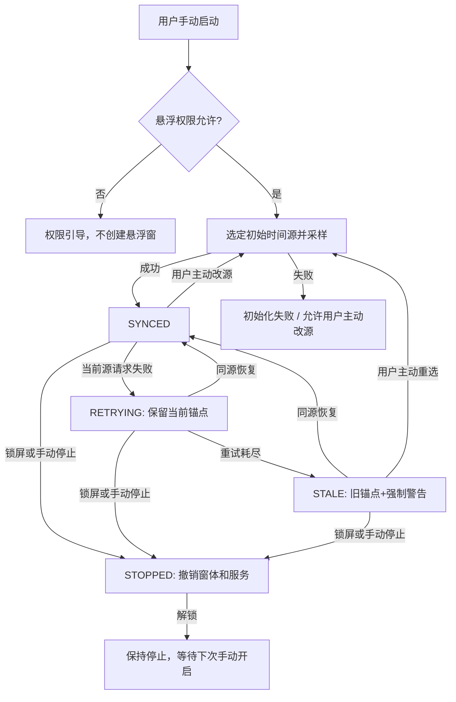
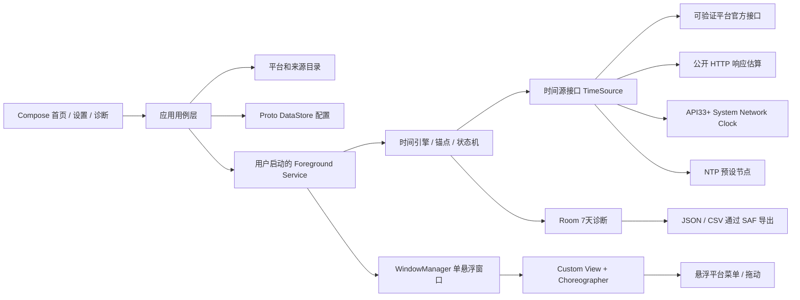

# 悬浮高精度时钟 App — 产品需求文档（PRD）

> **项目代号**：Floating Precision Clock（暂定；正式名称及仓库名在建仓时确定）  
> **文档版本**：v1.0｜**状态**：六轮 Grill Me 需求确认完成，作为 v1.0 开发基线  
> **编制日期**：2026-09-24  
> **目标平台**：Android 12+（minSdk 31），小米 14 Pro / HyperOS 3 优先验收  
> **发布方式**：免费开源，MIT，GitHub Actions，GitHub Releases 签名 APK  
> **文档约定**：**[已确认]** 表示产品决策；**[建议初值]** 表示实施时应通过真机测试调优，不属于已经得到验证的事实。

---

## 0. 执行摘要与关键决策

本产品是一款面向购物秒杀场景的 Android 高精度悬浮时钟。用户手动启动后，可以在其他 App 上层展示公共网络时钟；可选至多三个按顺序排列的公共行或手动偏移预设，点击悬浮容器选择显示行，长按整体拖动。支持全局与平台偏移、毫秒显示、智能校时、时间来源说明和本地诊断。**不提供倒计时、下单、自动抢购或其他自动化操作。**

- **公共时钟与五个手动偏移预设**：新安装默认公共单时钟。淘宝／天猫合并为一个预设，另有京东、美团、拼多多、抖音；均不是已接入的官方平台时间。旧用户的 PlatformId、偏移、排序与样式无损保留，不静默切换为公共行。
- **完全本地**：不部署开发者后端，不内置需要保密的 AppKey，不依赖登录用户购物账户。初次选择时间源时可以回退到公共网络时间；运行中当前来源失效**不自动切换**，保留旧基准、重试并告警，原来源恢复后自动重新校准。
- **来源真名实姓**：平台官方可验证接口、平台网页 HTTP 响应估算、Android 系统网络时钟、NTP 是不同类型；选择“京东”不意味着数据一定来自京东官方。各来源是否真实可用，需要独立审计，**本文不预设任何特定平台已有可直接调用的毫秒级官方接口**。
- **精度目标**：相对所选购物平台**可验证的官方服务器时间**，争取小于 50ms；不是保证值。首版发布不以达到这一指标为硬性条件。没有独立可信参照时只显示估计偏移、测量信息和“未验证”，不得报告“实际误差”。
- **显示与运行**：毫秒格式默认 `HH:mm:ss.SSS`，时区默认 `Asia/Shanghai`；120FPS 优先，跟随真实屏幕刷新与系统调度；锁屏立刻停止校时和悬浮服务，解锁不自动重启。
- **技术选型**：Kotlin 原生、Jetpack Compose 主界面、`WindowManager` + 轻量 Custom View 悬浮层、`Choreographer` 帧驱动、`elapsedRealtimeNanos()` 单调时钟基准、Proto DataStore 配置、Room 七天日志。

### 0.1 原始选择冲突的最终处理

| 议题 | 最终裁定 |
|---|---|
| 最初六个平台，最后选择“淘宝和天猫合并” | 保留六个品牌覆盖目标，呈现五个可选入口；淘宝／天猫共用一个入口、偏移和显示行 |
| “没有官方接口使用公共时间”与“运行中不自动换源” | 仅**初始选源／用户主动改源**时可兜底；已经启用的时间源在会话中失效时不自动改用其他类型 |
| “官方时间优先”与“纯本地、无私有密钥” | 仅接入真正公开、可合法直接访问的来源；不可用时显示实际使用的其他来源，不虚构官方能力 |
| “毫米级数字”与“50ms 真实误差” | 数字显示的毫秒位不构成精度证明；来源分辨率与独立测量共同决定能否验证 |
| 直接拖动与点击穿透 | 点击打开菜单，长按整体拖动；承认悬浮窗覆盖的矩形区域可能拦截底层操作，不承诺穿透 |

### 0.2 v0.6.0 已确认的产品修订

本节为用户确认的修订，优先于下文沿用的“平台入口／平台时间”旧称。

- 一个会话共享一个实际来源；没有已接入的购物平台官方时间接口。
- 新安装默认公共单行；公共行与五个手动偏移预设合计最多三行，首页跟随首行。
- 公共行只叠加全局偏移，预设行再叠加对应的独立偏移。未知实际误差仍标为未验证。
- 已有配置首次升级保留原平台选择、顺序、全部偏移、样式与来源；非阻断说明允许主动改用公共单行，且不删除偏移。
- 正式导航为“时钟／外观／诊断”，各页独立状态。外观草稿一次应用，高级设置承载来源、时区与偏移。
- 完整／紧凑／极简悬浮密度均保留实际来源与未验证／异常状态，预设名称明确标注手动性质。
- 诊断匹配组仅是 UI 展示，不修改 Room 原始数据，不代表网络请求次数；导出仍保留原始行。
- home.2 的 A「静谧卡片」为浅／深主题基线。仍不承诺 50ms 或真机 120FPS。

## 1. 背景、用户与目标

### 1.1 背景

在秒杀活动临近整点时，用户希望在当前购物 App 内直接观察高精度时钟，而非频繁切换到系统时钟。手机系统时间、平台公开返回时间、平台实际业务时间以及屏幕刷新延迟可能不同。因此，本产品同时解决**查看便利性**与**时间来源透明性**，而非保证能提高任何订单的抢购成功率。

### 1.2 目标用户及关键任务

- 在淘宝／天猫、京东、美团、拼多多或抖音浏览活动时，仍可查看毫秒格式时钟。
- 根据真实可用的来源选择官方接口、网页响应估算或公共网络时间，并知道当前显示值是否可验证。
- 同时对照 1～3 个平台入口，按个人习惯配置样式及手动偏移。
- 网络波动时明确发现旧校准结果已经失效，而不是被仍然跳动的毫秒数字误导。
- 能导出本地诊断记录，复现校时问题，不把个人数据交给项目维护者。

### 1.3 目标与非目标

| 类型 | 说明 |
|---|---|
| P0 功能目标 | 五个入口覆盖六个品牌、最多三行悬浮、多种显示模式、时区与偏移、公开来源适配、手动及智能校时、真实来源标注 |
| P0 稳定性目标 | 目标设备手动开启后可跨普通购物 App 展示；锁屏自动完全停止；拒绝通知权限时有主界面停止通道 |
| P0 可信目标 | 不冒称官方、误差可验证与不可验证明确区分、失败不静默换源、诊断可导出 |
| 努力目标 | 在具备可验证官方高精度来源且网络适合时争取小于 50ms；设备支持时争取 120FPS |
| 非目标 | 抢购成功率承诺、自动下单／点击、活动倒计时／提醒、后台云服务／账号、开机自启、自动识别购物 App、首版 iOS |

## 2. 术语与时间模型

- **手动偏移预设（原 Platform）**：保留原 PlatformId 的用户显示偏移配置，例如“淘宝／天猫 · 手动预设”；与实际时间来源分离。公共行不是任何平台 ID 的别名。
- **时间源（Time Source）**：获得原始 UTC 时间基准的具体适配器实例，拥有稳定 `sourceId`、来源类别和端点描述。
- **官方接口（OFFICIAL_API）**：平台有明确证据认可其时间含义，并提供可合法、无保密密钥直接访问的接口；“来自平台域名”不足以认定为秒杀业务时间。
- **网页响应估算（HTTP_ESTIMATE）**：从公开网页的响应 `Date` 等头部获取粗粒度时间，并结合响应耗时估算；响应可由 CDN／代理产生，不能命名为官方高精度时间。
- **公共网络时间（SYSTEM_NETWORK / NTP）**：UTC 参考来源，**不是任何购物平台官方时间的替代证明**。
- **校准锚点（Time Anchor）**：`serverEpochNs`（或毫秒及纳秒余数）和同一瞬间的 `elapsedRealtimeNanos`，用于持续推算。
- **偏移（Manual Offset）**：用户主动添加的全局与平台修正值；是人为修正，**不自动提高被验证的准确度**。
- **估计不确定度**：对当前来源测量链可解释的区间估计；不能验证时显示“未知”，不拿 RTT/2 直接冒充误差上界。
- **实测误差**：使用独立、可信、精度已知的官方参照与经过校准的测试手段测得，必须记录参照、测量方法、设备及网络条件。
- **会话**：从用户手动开启悬浮窗，到用户停止、锁屏或系统终止的生命周期。

## 3. 范围与优先级

| 编号 | 功能 | 优先级 | v1.0 要求 |
|---|---|---|---|
| F01 | 首次引导与权限管理 | P0 | 必须 |
| F02 | 单个悬浮容器 + 1～3 平台行 | P0 | 必须 |
| F03 | 点击菜单／长按拖动／排序 | P0 | 必须 |
| F04 | 4 种视觉皮肤 + 3 种信息模式 | P0 | 必须 |
| F05 | 官方／HTTP 估算／系统网络／NTP 来源适配接口与来源审计 | P0 | 必须；实际官方源视审计结果 |
| F06 | 智能校时、失败保留与同源恢复 | P0 | 必须 |
| F07 | 全局 + 平台偏移、时区 | P0 | 必须 |
| F08 | 120FPS 优先帧驱动与锁屏停机 | P0 | 必须 |
| F09 | 本地七天诊断、JSON/CSV 导出 | P0 | 必须 |
| F10 | GitHub 开源、测试、签名 APK | P0 | 必须 |
| F11 | 跨平台自动识别／定时提醒／倒计时 | Out | 不实现 |
| F12 | 官方时钟 <50ms 强保证／超越系统限制显示 | Out | 不承诺 |

## 4. 信息架构与用户流程

### 4.1 页面结构

1. **首页**：当前悬浮状态（未启动／运行／异常），平台入口列表、最多三项的已选列表、立即同步、启动／停止按钮，当前真实来源及最后校准时间。
2. **平台管理**：五个入口的添加／删除／排序；淘宝／天猫只有一个项目；平台级偏移和默认来源；超过三项时拒绝添加并给出替换入口。
3. **时间源详情**：来源类别、合法性及精度能力、最后采样、当前选择（自动／手动）、预设公共时间源的实际名称／端点描述、错误说明。
4. **悬浮样式设置**：四种视觉皮肤、完整／紧凑／极简、字体大小／颜色／透明度、背景属性（随皮肤）、时区、当前预览。
5. **校时与偏移设置**：全局偏移、各平台偏移、手动立即校时、测量详情；偏移单位 ms，带正负号并有恢复默认确认。
6. **诊断与关于**：七天日志查询、状态及 RTT 等指标、导出 JSON/CSV、清除日志、开源协议、隐私说明、版本与仓库链接。

### 4.2 首次启动流程

`打开 App → 阅读“显示毫秒不等于平台实际精度”的说明 → 勾选初始平台（默认一个，可修改）→ 悬浮窗权限检查和系统设置跳转 → （Android 13+）可选申请通知权限 → 显示当前选源结果／未验证状态 → 用户点击“开启悬浮窗”。`

- 没有悬浮窗权限时不创建窗口；用户返回 App 后重新检测，不通过无障碍服务或其他方式绕过授权。
- 拒绝通知权限不阻断启动；显示明显的主界面“停止”按钮，说明通知栏控制可能不可用。
- 无网络又无本会话成功锚点时**不伪装为已校准的平台时间**；可以显示显式的“未校准／无可信时间”的占位信息并允许重试。

### 4.3 日常操作与触摸

`首页选择平台 → 启动 → 切换到购物 App → 点悬浮容器打开平台菜单／长按容器拖动 → 用户从菜单调整 1～3 行、切换当前平台或进入设置 → 常驻通知或首页停止。`

- 整个容器作为**一个** `TYPE_APPLICATION_OVERLAY` Window 管理；各行是同一 Custom View 内部的逻辑布局，避免每行独立 Window 的定位和性能复杂性。
- 点击：显示轻量平台菜单，提供勾选（最多三项）、拖动排序入口、立即同步、关闭菜单；可跳转主界面设置。菜单出现时暂停时钟非必要动画，但时间基准继续推进。
- 长按：进入整体拖动；判定达到长按阈值才开始移动，取消此次点击菜单操作。拖动结束后保存相对安全区域的位置，旋转、分辨率或窗口变化时恢复到可见范围。
- 操作的具体长按阈值、最小点击区域及动画时长作为 Android 无障碍与真机体验调优参数，不在产品层硬编码毫秒数。
- **触摸覆盖约束**：悬浮容器矩形内的触摸可能被拦截；容器外不拦截。绝不宣称能在整块可拖动时钟下方同时穿透购物按钮。
- 其他 App 可能主动隐藏第三方 Overlay；应显示 App 侧可见性与兼容性说明，不绕过宿主 App 的遮挡策略。

### 4.4 显示模式

| 模式 | 默认显示 | 异常覆盖 |
|---|---|---|
| 完整 | 平台名称、真实时间源类别、毫秒时间、状态和可解释的精度信息 | 必须突出失效／未知状态 |
| 紧凑 | 平台名称、状态图标、毫秒时间；点击可见真实来源 | 异常图标／短标签不可隐藏 |
| 极简 | 只显示毫秒时间；点击菜单可查平台及来源 | **异常警示必须覆盖极简规则**，避免误导 |

四种皮肤均支持：深色、浅色、半透明磨砂玻璃、无背景纯数字；所有行继承统一的字体、字号、颜色和透明度；不支持 v1 每个平台独立皮肤。默认单行，最多三行。默认 `Asia/Shanghai`、`HH:mm:ss.SSS`，可自定义显示时区，但时区不参与 UTC 校准计算。

## 5. 平台管理与来源边界

### 5.1 五个入口的来源目录

| 入口 ID | 品牌覆盖 | 初始独立偏移 | 官方时间源 v1 状态 | 兜底策略 |
|---|---|---|---|---|
| TAOBAO_TMALL | 淘宝、天猫 | 一份 | 待开发审计；不可预设一定可用 | 无经验证可用源时初始使用公共时间并说明 |
| JD | 京东 | 一份 | 待开发审计 | 同左 |
| MEITUAN | 美团 | 一份 | 待开发审计 | 同左 |
| PDD | 拼多多 | 一份 | 待开发审计 | 同左 |
| DOUYIN | 抖音 | 一份 | 待开发审计 | 同左 |

淘宝／天猫合并入口采用**一个明确标注的当前时间源**；如果将来发现两者确有不同的可验证业务时间，本产品不得继续暗示合并入口同时代表两个官方时钟，需要后续版本重新评审拆分。首版保留业务覆盖，不凭空制造秒杀时间差。

### 5.2 来源准入审计（每个候选适配器必须留档）

- 平台名称、域名、接口描述、公开文档或访问依据、是否涉及账号／Cookie／签名／AppKey、允许访问范围及频率限制、接口响应样例（脱敏）、时间字段定义、时间分辨率、CDN／缓存风险、维护者及最近复核日期。
- 只有可合法访问、无需内置秘密或绕过鉴权的源才能加入默认构建；不能静默模拟官方客户端身份、抓取用户 Token、绕过验证码或违反平台接口限制。
- `OFFICIAL_API` 只在**平台接口语义有证据**时使用；网页 `Date` 一律 `HTTP_ESTIMATE`；`Last-Modified`、客户端接收本地时间或过期缓存不得作为官方当前时间。
- 对于要求保密签名密钥的官方接口，v1 不直接嵌入密钥；不引入服务端代理（产品已明确“完全本地，无后端”）。
- API 与 HTTP 时间估算都必须检验响应新鲜度、`Date` 是否存在／合法、`Age`／缓存相关头、重定向及可信 HTTPS 链路；不满足准入标准时标记不可用。
- `HTTP Date` 通常仅有**秒级**精度；无服务端接收／发送时间戳时，本地 RTT 插值不能把它变成经过验证的 50ms 官方时间。对 HTTP 估算需单独报告量化／时间戳位置／缓存导致的未知或宽区间不确定度。
- 各平台默认源的实际选取由**实测审计**决定；若全无官方来源，也必须按承诺让五个入口能明确以公共时间显示，不虚构不同平台的官方秒差。

### 5.3 自动选源与手动指定

- 初次会话／用户重新选源：按候选可用性优先级选择经审计通过的平台官方来源 → 合规网页 HTTP 估算 → 公共网络来源；允许手动选其中实际可用的来源。优先级为默认产品策略，不构成“网页估算一定比 NTP 准确”的断言；测量结果差时应向用户解释推荐理由。
- 公共网络来源在 **API 33+**：优先 `SystemClock.currentNetworkTimeClock()`，不可用时在**新会话初始选择／用户主动重选**中使用预设 NTP；在 **API 31–32**：使用预设 NTP 和启动期备用候选。普通 `System.currentTimeMillis()` 不算可信联网校准。
- 用户手动指定后，不允许智能策略在背后改成其他类别；手动指定源当前不可用时明确失败并支持用户主动切源。
- **已启动会话中的故障**：既有 `sourceId` 固定，失败后同源重试／同源探测／保持旧锚点；不得在运行中自动切成 HTTP、系统网络或另一 NTP 端点并继续假装原来源恢复。原来源恢复后可以自动应用新校准。
- 若同一公共源内部提供多个预设端点，端点变化视为显式**重新选源**；首版在当前会话中不做无提示自动端点切换。

## 6. 校时算法与误差表达

### 6.1 时钟基准与显示公式

网络 I/O 不得阻塞 UI 线程。每个已选平台持有一个有效 `TimeAnchor`（如来源可共享可引用相同原始锚点），以 `elapsedRealtimeNanos()` 推进 UTC；**用户偏移在显示层叠加，而不是污染原始样本。**

```text
rawUtcNs(now) = anchor.serverUtcEpochNs
              + (elapsedRealtimeNanos(now) - anchor.localMonoNs)

shownUtcNs(platform, now) = rawUtcNs(now)
                          + globalManualOffsetMs * 1_000_000
                          + platformManualOffsetMs * 1_000_000

shownLocalTime = format(shownUtcNs, selectedZoneId, HH:mm:ss.SSS)
```

- 系统墙上时钟变更、用户切换时区或时钟 App 设置，**不得直接改写既有原始锚点**；仅选定显示时区影响最终格式。
- 时间源按其实际精度保存 UTC 基准（必要时为毫秒及小数余数）；源码避免多次以低精度 `Long` 毫秒四舍五入造成累计跳动；时间差计算用单调纳秒。
- 重启或设备重启后，旧锚点的单调基准不能跨引导阶段直接继续使用；**锁屏停止后的下一次手动启动须重新校时**。仅可展示“上次校时于……”，不能当成有效当前时间。
- 原来源恢复后，新锚点更新需避免毫秒数字倒退造成视觉错觉：可以在短暂校准提示期间**明确呈现校准跳变**或做**时间速率微调**；绝不悄悄将偏移错误藏于平滑动画。若跳变幅度较大需记录事件。

### 6.2 NTP 四时间戳与 RTT

采用标准 NTP／SNTP 的四时间戳 `t1` 客户端发送、`t2` 服务器接收、`t3` 服务器发送、`t4` 客户端接收。用于诊断的经典近似公式：

```text
networkDelay δ = (t4 - t1) - (t3 - t2)
clockOffset θ = ((t2 - t1) + (t3 - t4)) / 2
```

其中 `t1` 和 `t4` 的本地时间差应由单调时钟支撑；构建同一时间轴上的本地发包／收包时间标签，再应用 offset，避免手机系统墙上时钟中途变化破坏 RTT。需检查 NTP leap／stratum／Kiss-o'-Death 等状态（若协议实现提供）、时间戳有效性、RTT、超时和异常样本。移动网络可能限制 UDP 123；不可用时按当前来源故障规则提示，不假定一定能访问。

### 6.3 官方及 HTTP 来源估算

- 对**确实具有服务器接收／发送高分辨率时间戳**的接口，在其语义和传输路径可信时，依据服务端字段和单调发送／接收时间估算偏移、网络延迟和误差条件。
- 对**只有一个服务端时间戳**的接口，只有在文档确认时间戳采样阶段、响应缓存行为与时间分辨率后，才能使用 RTT 中点等近似；不明时记录“采样位置未知／不确定度未知”。
- 对仅有秒级 HTTP `Date` 的网页响应，不得仅通过 RTT/2 或补齐 `.SSS` 得出所谓毫秒级官方时间；估算值、分辨率限制与 HTTPS／CDN 信息一并展示。
- 本机网络时间仅可作为公共 UTC 基准；不存在可靠的“公共 NTP 与平台业务时钟固定差值”假设。

### 6.4 智能采样与锚点择优

**[建议初值；允许调优]** 初始采样 3～5 次，优先选择响应新鲜、延迟较小、候选偏移稳定的结果；使用中以网络稳定性、来源文档限频、上次成功采样和估计误差趋势决定下一次间隔（例如 30 秒～5 分钟的可配置工程区间，不将其定义为平台官方允许频率）。

- 记录每次采样 RTT／来源分辨率／异常或缓存标志、偏移估计和不确定度；对明显异常 RTT 或偏移样本拒绝更新锚点。
- 若官方接口有更严格访问频率或请求限额，**以官方允许频率优先**；缺少清晰限制时保守访问，不使用高频轮询来追求假精度。
- 在显示时钟的每个渲染帧更新**推算值**，而不是每一帧发起网络请求。
- 对于有上界证据的时钟漂移，可以按离开上次校准的时间扩大不确定度；无法验证漂移率或时间源量化误差时直接标记“未知”，绝不显示伪造的 `±5ms`。

### 6.5 误差等级与独立验证

| 字段 | 允许出现的条件 |
|---|---|
| 显示毫秒 | 所有存在有效锚点的来源；数字位数**不表达可靠性** |
| 估计偏移 | 测量模型有明确依据且记录输入数据 |
| 估计不确定度 | 误差假设、源分辨率与网络模型均可解释；否则 `null/未知` |
| 实测误差 | 使用独立可信、精度已知的**平台官方时间参照**且测试工具具有足够分辨率；附方法、样本数和局限 |
| “达到 50ms” | 只在对应平台、设备、网络条件及指定统计口径的有效测试结果满足条件时陈述；不扩展为所有用户／平台保证 |

测试中不得把同一条来源结果同时作为被测时钟与“独立参考”，也不得把屏幕录像帧间差直接当作毫秒级实测精度；屏幕显示还有帧延迟，应单独测量。

## 7. 校时、会话与故障状态机

### 7.1 状态定义

| 状态码 | 语义 | 时钟行为 | UI 行为 |
|---|---|---|---|
| STOPPED | 用户未开启／主动关闭／锁屏关闭 | 不更新，不校时 | 首页可启动 |
| INITIALIZING | 当前会话正在初始选源与首轮采样 | 不显示伪校准时间 | “正在校时” |
| SYNCED | 当前来源有成功、未过期锚点 | 以单调时钟推进 | 真实来源与状态正常 |
| RETRYING | 同一来源一次或少量失败，正在短暂重试 | 暂存并使用旧锚点，若旧锚点不足则占位 | “重试中”，可看上次成功时间 |
| STALE | 同源连续失败达到告警条件 | 如有旧锚点继续推算，否则无可信时间 | 强制警告“校时已失效／实际误差未知”；仍定期探测原来源 |
| RESELECT_REQUIRED | 当前来源明确失效／被禁用且无法继续使用 | 旧锚点仅作已过期数据，不当作已校准时间 | 引导用户主动选源 |
| PERMISSION_BLOCKED | 缺少悬浮权限或服务不合法 | 不创建悬浮窗 | 申请或说明权限 |

### 7.2 核心迁移



**[建议初值]** 每次短暂重试上限 3 次、带退避和抖动；失败阈值可调。转为 STALE 后降低频率对**同一个 sourceId** 探测，不能静默转为公共时间。任何新来源必须由用户初始选源流程或明确手动操作触发。

### 7.3 极端异常

- **断网／高 RTT／HTTP 403／429／超时**：同源限频重试，避免反复触发封禁，超阈后 STALE。
- **HTTP Date 缺失／时间戳过期／缓存可疑**：拒绝本次更新，日志记录原因；不可擅自提升官方来源评级。
- **用户改系统时钟／改时区**：原锚点连续；时区只改变展示；下次采样重新检验偏移。
- **手动偏移很大**：可保存，但对用户明确提示“包含人为偏移，官方时间精度未经由此提升”。
- **窗口权限被撤销／宿主阻止显示／系统杀服务**：清理资源、展示恢复指引；系统杀进程时不承诺立即通知，也不后台自启。
- **通知权限拒绝**：仍允许手动启动，首页始终有停止入口；OS 可能只在其前台服务管理界面显示服务信息。
- **锁屏**：通过屏幕关闭事件及进程内交叉检查终止校时、取消帧回调、移除悬浮窗并停止服务；系统广播投递存在延迟，不承诺毫秒级锁屏终止时延。
- **解锁／重启设备**：不自行恢复悬浮服务；下次点击启动重新校时，不能复用旧单调锚点。

## 8. Android 端技术架构

### 8.1 选型与分层

首版选择 **Kotlin 原生**。主界面使用 **Jetpack Compose**，悬浮时钟部分使用 **Custom View + WindowManager**（避免在高频、小尺寸悬浮显示场景增加不必要的视图树开销）。渲染以 VSYNC 为节奏使用 `Choreographer` 回调；后台与 UI 通过 `StateFlow` 等响应式状态传递，采样使用 Kotlin 协程和结构化并发。



建议 Gradle 模块（具体拆分可依赖代码规模增减）：

```text
app/                       # Compose 页面、导航、权限和入口
core/model/                # Platform、TimeSource、Anchor、CalibrationState
core/time/                 # 单调时钟、偏移算法、采样择优、智能调度
core/sources/              # 官方 / HTTP / 系统网络 / NTP 适配器
core/storage/              # Proto DataStore、Room、日志清理
feature/overlay/           # 前台服务、WindowManager、Custom View、交互
feature/diagnostics/       # 统计、可验证误差模型、JSON/CSV 导出
```

模块边界为建议而非强制“单功能一模块”。依赖只能从 UI／Service 指向用例和抽象，从来源适配器指向接口；不能由业务状态机反向依赖 Compose。

### 8.2 关键接口及线程策略

```kotlin
interface TimeSource {
    val sourceId: String
    val kind: SourceKind
    suspend fun sample(): CalibrationSample
    fun capability(): SourceCapability
}

interface MonotonicClock {
    fun elapsedRealtimeNanos(): Long
}

data class TimeAnchor(
    val sourceId: String,
    val bootSessionId: String,
    val sourceEpochNs: Long,
    val localMonoNs: Long,
    val resolutionNs: Long?,
    val uncertaintyNs: Long?,
    val uncertaintyVerifiable: Boolean,
)
```

- Service 负责唯一会话、生命周期、权限变化与取消；**禁止把阻塞网络 I/O 或 Room 导出放在主线程**。
- `TimeSource` 使用 `suspend`，调用可取消；真正网络适配器有超时、限频与拒绝缓存规则。
- 时间引擎持有平台到来源映射、来源到当前锚点映射、同源恢复状态和来源共享引用计数；多行共享同一 `sourceId` 时**只对来源采样一次**。
- Overlay 只订阅需要渲染的紧凑不可变状态，**每帧只在本地推算当前时间**，不订阅高频 Flow 或反复读数据库。
- 进程恢复后通过新会话校时而不是从磁盘恢复可用 `TimeAnchor`；数据库只记录历史事实，不代表锚点跨设备重启有效。

### 8.3 前台服务及系统版本兼容

- 使用 `TYPE_APPLICATION_OVERLAY`，请求 `SYSTEM_ALERT_WINDOW`，用户在首页显式启动；`FLAG_NOT_FOCUSABLE` 及窗口大小依实际交互配置，确保悬浮窗外不拦截点击。不得通过无障碍权限或通知读取实现功能。
- 在 targetSdk 34+ 时必须声明与用例相符的前台服务类型及权限。对于需要长期展示、未落入其他标准类别的悬浮时钟，**优先评估 `specialUse` 的适用性**，在 Manifest 说明清晰的特殊用途；不要仅为了绕过限制滥用 `dataSync`。即使只发 GitHub APK，也应遵循 Android 平台行为约束；未来若申请 Play 上架需重新审查。
- 主界面处于前台时启动服务；不从锁屏、BOOT_COMPLETED 或后台被动事件尝试启动。Android 15+ 对持有悬浮窗权限的应用从**后台**发起前台服务有额外可见窗口条件；本产品的手动前台启动设计不依赖该后台豁免。
- Android 13+：可选请求 `POST_NOTIFICATIONS`。被拒绝时仍可启动前台服务，但通知是否出现在抽屉受系统管理；维持首页停止通道。Android 12：无需这一运行时权限。
- 锁屏应主动停止 Service 并移除 Overlay；为异常退出／异常重启定义幂等清理，且 **`START_NOT_STICKY` 或等效“不开机／不意外重启”策略** 需经真机验证。
- 悬浮窗在状态栏、系统键盘、受保护页面等位置的显示由操作系统决定，v1 不承诺所有页面均可覆盖。

### 8.4 120Hz 渲染策略

- 仅当 Overlay 实际可见、屏幕交互状态允许时注册下一帧 `Choreographer` 回调，计算 `rawUtcNs + offsets` 后绘制。窗口关闭／屏幕关闭／被移除时取消回调，避免不可见空转。
- 目标 120FPS 仅在设备当前显示模式与系统允许时尽量达到；60Hz、90Hz 或更低模式应自然自适应，**不得为了显示 120 个数字而启用忙等待或重复绘制同一物理帧**。
- 数字使用等宽字体特性、预创建文字布局／画笔和最小脏区域；避免每帧重新测量容器、生成多余格式化对象或产生频繁 GC。
- 监测真实回调间隔分布、实际 FPS、jank（帧耗时超过相应帧预算的比例），并把这些指标与 **时钟精度** 分开；`Choreographer` 的回调时间不是网络时间源。
- 120Hz 时单帧理论周期约 8.33ms；显示毫秒值会按真实经过时间跳跃约 8～9ms，而不是连续逐毫秒显示每个数字。

## 9. 数据模型、存储与导出

### 9.1 稳定模型

| 模型 | 关键字段 | 持久化策略 |
|---|---|---|
| `PlatformConfig` | `platformId`、`enabled`、`sortIndex`、`manualOffsetMs`、`selectionMode`、`preferredSourceId?` | Proto DataStore |
| `GlobalSettings` | `globalOffsetMs`、`zoneId`、`skin`、`densityMode`、`fontSizeSp`、`textColorArgb`、`windowAlpha`、`overlayXRatio/YRatio`、`selectedPlatformIds` | Proto DataStore |
| `SourceDescriptor` | `sourceId`、`kind`、`platformIds`、`displayName`、`domainOrHost`、`precisionClass`、`auditStatus`、`rateLimitPolicy` | 代码中可信目录／版本化数据；无远程动态指令 |
| `CalibrationSample` | `sampleId`、`sourceId`、`requestStartMonoNs`、`responseEndMonoNs`、`serverTimestamp`、`rttNs`、`offsetEstimateNs?`、`uncertaintyNs?`、`validityFlags`、`errorCode?` | Room，保存 7 天 |
| `SessionRecord` | `sessionId`、`startedAtEpochMs`、`endedAtEpochMs?`、`stopReason`、`androidApi`、`deviceSummary`、`appVersion` | Room，保存 7 天 |
| `CalibrationEvent` | `eventId`、`sessionId`、`platformId`、`sourceId`、`statusBefore/After`、`eventTimeEpochMs`、`lastSuccessEpochMs?`、`reasonCode`、`estimatedDrift?` | Room，保存 7 天 |
| `TimeAnchor` | `bootSessionId`、`sourceEpochNs`、`localMonoNs`、`sourceId`、`resolutionNs`、`uncertaintyNs?`、`verifiedStatus` | **仅内存有效**；允许数据库记录脱敏历史，但禁止恢复为活跃锚点 |
| `ReferenceTest` | `platformId`、`referenceSource`、`referencePrecision`、`testMethod`、`networkType`、`sampleCount`、`measuredErrorDistribution?`、`validity` | 本地验收报告（可单独导出） |

所有时间内部统一 UTC，任何时间类型均需指定 `epoch`／`monotonic`，不能把二者混算。平台枚举使用稳定 ID，展示文案可以本地化。偏移以有符号毫秒存储，超出产品可接受范围时给明确提示；具体最大值作为 UI 实施参数。

### 9.2 配置示例（说明性的 JSON 表示，不强制 DataStore 文件格式）

```json
{
  "schemaVersion": 1,
  "selectedPlatformIds": ["TAOBAO_TMALL", "JD"],
  "globalOffsetMs": 0,
  "zoneId": "Asia/Shanghai",
  "displayMode": "COMPACT",
  "skin": "DARK",
  "preferredFpsPolicy": "FOLLOW_DISPLAY_UP_TO_120",
  "platforms": {
    "TAOBAO_TMALL": {"manualOffsetMs": 0, "selectionMode": "AUTO", "preferredSourceId": null},
    "JD": {"manualOffsetMs": 35, "selectionMode": "MANUAL", "preferredSourceId": "source-id-from-audit"}
  }
}
```

### 9.3 诊断日志与隐私

- 记录最近 7 天的**成功与失败**校时样本、重试、状态变化、校时跳变和必要的渲染指标；旧日志由本地定时清理或打开诊断页时清理，应用未被启动时不承诺后台准点清理。
- 不记录购物账号、页面内容、Cookie、身份凭据、完整 URL 查询串、用户精确位置或不必要的网络标识；域名／预设主机足以诊断时不得记全 URL。
- 不上传遥测；提供“清除全部日志”。无账号、无 SDK 广告追踪；未来新增第三方 SDK 必须重新审查隐私承诺。
- 导出通过 Android Storage Access Framework `ACTION_CREATE_DOCUMENT`，让用户选择本地位置。导出包含版本、时区、记录时间单位、字段字典、匿名设备基础信息、来源类别及每条样本状态；JSON 和 CSV 同一数据集内容一致。
- CSV 使用 UTF-8、规范引号与逗号转义；必要时对可能被表格软件解释为公式的字符串进行安全转义。敏感字段无论日志页还是导出均剔除。

## 10. 功能详细验收规则

### 10.1 F01 首次启动／权限

- 首次启动有明确告知：毫秒显示不是精度保证；HTTP 网页来源、公共时间与官方接口不同。
- 无 Overlay 权限时启动按钮不可用；有明确申请步骤与授权返回检查；拒绝通知权限时启动仍可用并提示通过首页停止。
- 不申请无障碍、使用情况访问或查询全部已安装 App 权限；不自动识别当前购物应用。

### 10.2 F02/F03 悬浮与菜单

- 默认一个入口，可增至三个；第四项被拒绝并提供“替换”操作；任意排序后离开并重启 App 顺序不丢失。
- 点击弹出菜单，长按拖动；拖动只改变容器位置，不改变所显示的 UTC 基准；多行共享同一个 Window；横竖屏及刘海／安全区域变化后容器仍可找回。
- 购物 App 非遮挡区域正常响应点击，容器内操作拦截符合已确认设计；无法跨越系统或宿主 App 的 Overlay 禁止策略。

### 10.3 F04 视觉

- 4 种皮肤与完整／紧凑／极简三模式可以组合；支持全平台统一字号、颜色、透明度，变更实时预览。
- 显示和格式化采用用户选择的时区，默认北京时间；极简状态下**校准失效警告仍必须可辨识**。
- 如果字号过大或三行超屏，应限制到可见范围、提示调整或滚动菜单，不能让关闭入口永久不可见。

### 10.4 F05/F06/F07 校时与偏移

- 每次采样记录真实类别；官方接口的声明附来源审计；无法证明时显示未验证。
- 时间源自动选择与手动指定生效；运行中失败不自动变更 `sourceId`，恢复同源后自动重新锚定。
- 修改全局偏移影响所有行，各平台偏移只影响该行；原始锚点不被修改。多行若共享公共来源而偏移不同，应显示不同的修正时间，但**不能因此视为不同官方时间**。
- 系统时钟被用户大幅调整时，既有校准结果仍按单调时钟前进；时区变化仅格式改变。

### 10.5 F08 运行与性能

- 亮屏运行期间后台切换普通购物 App 不主动停止；用户手动停机或锁屏时撤销窗口／采样／帧循环；解锁后保持 STOPPED。
- 在小米 14 Pro 实测刷新、帧耗时和电量消耗；每秒网络请求数不能跟随 FPS 增加。

### 10.6 F09/F10 诊断与开源

- 七天清理、JSON／CSV 导出和隐私脱敏经过自动化测试；失败日志与正常日志均可检索。
- GitHub Actions 在可信 Release 工作流签名；仓库没有私钥、密码或真实用户采样敏感数据。

## 11. 性能、可靠性与精度指标

以下表格把**产品硬要求**与**工程争取目标／建议初值**明确分开。

| 指标 | 口径 | 性质 | v1.0 判定 |
|---|---|---|---|
| 显示格式 | 时分秒+3 位毫秒 | P0 硬要求 | 五入口均可显示，未校准时不可伪造当前时间 |
| 对官方时间误差 | 独立可信平台参考，明确测试条件 | 努力目标 | <50ms 争取达到；不达标不阻止发布，但公开实测与限制 |
| 来源可信标注 | 官方／HTTP 估算／系统网络／NTP | P0 硬要求 | 无误标，HTTP `Date` 不冒称官方毫秒 |
| 渲染节奏 | 屏幕允许且 Overlay 可见时实际 FPS | 努力目标 | 120FPS 优先；受系统限制时自适应；绝不空转 |
| 主线程流畅 | 视图绘制、菜单交互、拖动 | P0 硬要求 | 不在主线程网络采样或数据库导出，无明显卡顿／ANR |
| 智能请求频率 | 尊重来源许可、网络质量与状态 | P0 硬要求 | 来源文档限频高于一切，帧率不驱动网络请求 |
| 弱网处理 | 超时、丢包、UDP 封锁 | P0 硬要求 | 失效警告可见，旧锚点不伪装新校准、不静默换源 |
| 关闭清理 | 点击停止／锁屏 | P0 硬要求 | 无继续发包、无残留 Overlay、无无限回调 |
| 电池消耗 | 同一设备、同亮度、同网络及屏幕条件对比 | 工程观察值 | 发布测试报告，若严重耗电需优化并标注；不得伪造固定全机适用的百分比 |
| 兼容性 | Android API31～目标 SDK，小米 HyperOS3重点 | P0 硬要求 | 目标机真机通过；兼容矩阵按第 12 节 |

**[建议初值]** 在真机上可记录 10～15 分钟连续运行的 FPS 中位数／P95 帧间隔、前台服务内存走势、GC 次数、网络请求数、电量趋势（与无悬浮时钟的同环境基线对照），作为性能回归报告；阈值在基线稳定后于测试规范冻结，不能凭 PRD 臆定。

## 12. v1.0 验收用例与测试矩阵

用例具备可复现输入、可观察输出和明确 Pass/Fail。表中“模拟／假服务器”用于测试算法与失败条件，**不是用虚构的官方源证明现实 50ms 精度**。

| ID | 类型 | 操作／条件 | 通过标准 |
|---|---|---|---|
| T01 | 平台 | 查看全部入口 | 淘宝／天猫、京东、美团、拼多多、抖音共 5 个入口，覆盖 6 个品牌 |
| T02 | 平台 | 添加平台行至上限 | 默认 1 行，允许 2、3 行，拒绝第 4 行并提示 |
| T03 | 平台 | 排序并重启 App | 选中集合和排序持久化 |
| T04 | 触摸 | 点击／长按／拖动 | 点击菜单，长按拖动，互不误触 |
| T05 | 触摸 | 在购物 App 操作悬浮窗外区域 | 底层正常点击和滚动；悬浮区域可拦截 |
| T06 | 布局 | 改变字号、转屏、横竖分辨率 | 时钟在安全区域内可见，可恢复拖动／关闭 |
| T07 | 视觉 | 4 皮肤 × 3 信息模式 | 组合生效；失效警告在极简模式依然可见 |
| T08 | 格式 | 切换时区／临界跨日 | UTC 基准不变，格式及日期变化符合所选时区 |
| T09 | 偏移 | 全局 +35ms，京东 -20ms | 京东叠加净 +15ms；其他入口只 +35ms，原始锚点无变化 |
| T10 | 校时 | 官方来源候选无文档／需保密密钥 | 不收录为可直接用的默认官方适配器 |
| T11 | 来源 | 平台公开网页只返回秒级 Date | 标记 HTTP 估算、精度限制／未验证，不得称为官方毫秒时间 |
| T12 | 来源 | 某平台无可靠官方／网页接口 | 初始选源可使用明确标注的公共网络时间 |
| T13 | 来源 | API31／32 与 API33+ | 旧系统直接 NTP；API33+ 尝试系统网络时钟后允许初始 NTP 兜底 |
| T14 | 校时 | 假服务器产生固定偏移／随机 RTT | 推算值、RTT、拒绝异常样本符合模型；包含随机与边界单元测试 |
| T15 | 校时 | 增加屏幕 FPS | 网络发包频率不随帧率线性上升 |
| T16 | 校时 | 当前源超时，另一个来源可达 | 不自动改变 `sourceId`；重试后保留旧锚点并警告 |
| T17 | 校时 | 同一来源恢复 | 自动重新采样锚定，清除失效状态并记录事件 |
| T18 | 校时 | 用户主动重选来源 | 显式切源成功且来源标签随之改变 |
| T19 | 稳定 | 用户手动更改设备系统时间 | 同一活跃锚点仍按单调经过时间前进 |
| T20 | 稳定 | 网络断开、UDP123受限、HTTP403/429 | 不崩溃、适当限频、出现失败原因，无无穷重试风暴 |
| T21 | 权限 | 拒绝悬浮权限 | 无 Overlay，清楚指引申请；其他设置仍可浏览 |
| T22 | 权限 | Android13+ 拒绝通知权限 | 仍能手动运行（平台允许时），首页可停止 |
| T23 | 生命周期 | 切至普通购物 App | 持续显示且无后台自启权限请求 |
| T24 | 生命周期 | 锁屏后再解锁 | 服务、帧回调及发包停止；解锁不会自动恢复 |
| T25 | 生命周期 | 用户手动停止、服务被系统终止 | 正常清理资源；下一次仅用户主动启动 |
| T26 | 诊断 | 导出最近 7 天 JSON／CSV | 时间单位及字段一致；旧数据清理；可由测试脚本解析 |
| T27 | 隐私 | 注入模拟敏感参数到请求／错误 | 日志和导出不出现密钥、Cookie、原始隐私查询参数 |
| T28 | 精度 | 无独立官方参照 | 不出现“实际误差 <50ms”字样；只展示估算／未验证 |
| T29 | 精度 | 独立官方参照可用 | 测量报告包括方法、样本、参考分辨率、网络和误差分布；不达 50ms 可发布但须标注 |
| T30 | 渲染 | 60／90／120Hz 环境与强制低刷 | 跟随可用帧率，不高频空转；测 FPS 不误作准确度 |
| T31 | 多入口 | 两入口引用同一公共时间源 | 共享校时结果但各自偏移生效，不产生无意义重复采样 |
| T32 | 开源发布 | 从 Release 下载 APK、安装并升级 | 签名可验证、包名／签名连续，APK 和 SHA-256 可用 |

### 12.1 兼容性与设备覆盖

- **重点真机**：小米 14 Pro / HyperOS 3，验证 Overlay 权限、手动启动、系统权限被拒绝、锁屏停止、常驻通知、真实购物 App 中可见性、渲染和长时间表现。
- **模拟器／CI**：API 31、32、33、34、35，以及编译／目标 SDK 对应最新可用 API 的启动及关键功能；PR 可先跑代表性子集，主分支／Release 执行完整矩阵。若当前构建环境未提供某个 API 镜像，应在发布报告记载缺失并补充设备测试，而非伪称已通过。
- **跨厂商设备**：兼容目标，不是首版所有品牌真机签收条件；如宿主 App 禁止悬浮，需要记录但不尝试规避。

### 12.2 独立精度测试规范

1. 预先验证参照确实对应所测购物平台的官方时钟，提供公开依据或可信测试授权；若条件不存在，该入口标记“官方真实误差无法验证”。
2. 记录参照源分辨率、时延校正模型、测试设备、Android API、设备刷新率、Wi-Fi／蜂窝网络、样本数、置信区间或分位数。
3. 至少分别报告网络采样偏移估算分布和**独立参照实测误差**；没有独立参照时后者写 N/A，不能填估计值。
4. 单独测量屏幕渲染／摄录影响，不能用手机摄像头拍摄另一个秒级网页时钟来证明 <50ms。
5. 发布说明明确“工程目标”与“目前已验证平台／环境”，不得把局部测试扩展为全平台承诺。

## 13. 开发阶段与交付检查点

| 阶段 | 主要工作 | 必要交付物／退出标准 |
|---|---|---|
| S0 — 项目脚手架与来源审计 | 建立 Kotlin/Gradle/CI、权限测试壳；逐入口审计公开候选源 | 可运行空壳；来源目录首版；5 入口全部确定初始可用公共时间路径；未知官方能力明确列出 |
| S1 — 时间内核 | 单调时间、锚点、偏移、时区、系统网络／NTP 适配、假服务器测试 | T08–T09、T13–T15、T19 的自动化测试通过 |
| S2 — 悬浮体验 | WindowManager、Custom View、点击菜单、长按拖动、最多三行、皮肤与模式 | T01–T07、T21–T23 初步通过，小米真机可实用 |
| S3 — 平台来源与故障 | 接入**审计通过**的官方／HTTP 候选；智能采样、同源失败与恢复、告警 | T10–T12、T16–T18、T20、T28 通过；来源不实即下线候选 |
| S4 — 生命周期与诊断 | 前台服务、锁屏停机、性能优化、Room 七天日志、导出与脱敏 | T22–T27、T30–T31 通过；完成小米真机长时测试 |
| S5 — 验收与发布 | Android 兼容矩阵、来源及精度报告、GitHub Actions、签名管理、README/隐私说明 | T29/T32；全部 P0 测试可追溯；发布 v1.0 APK 与校验和 |

阶段允许并行，但 **S0 来源审计与 S1 时间模型需先形成稳定契约**；不得先凭猜测写死六家平台的所谓官方接口。每阶段在 GitHub Issues／Milestones 留下测试记录和未完成限制。

## 14. GitHub 开源、CI/CD 与 APK 发布

### 14.1 仓库结构与公开文档

```text
/
  app/ core/ feature/
  gradle/ .github/workflows/
  docs/architecture.md
  docs/time-sources.md         # 来源审计：证据、限制、更新时间
  docs/accuracy-testing.md     # 误差测量规范与实测报告
  docs/privacy.md
  README.md
  CONTRIBUTING.md
  SECURITY.md
  LICENSE                     # MIT
  .gitignore
```

- README（优先中文，可附英文摘要）需介绍使用场景、权限说明、Android 12+、五个入口／六个品牌、**时间来源不保证全为平台官方**、50ms 非保证值、安装方法与签名升级要求。
- 明确无后端、无购物账号读取、无定时抢购；不得使用未经授权的平台 Logo／商标暗示官方合作。
- 接受社区贡献时，新增时间源必须提供可复现测试、公开合法访问依据和精度标注；不合规的接口即使短期可用也不收录。
- 附带 THIRD-PARTY NOTICES（如依赖许可证需要）、隐私声明和漏洞披露渠道。

### 14.2 GitHub Actions 流程

```text
Pull Request:
  Gradle build / lint / unit tests / static checks
  + 代表性 API 模拟器测试
  -- 无生产签名密钥，无发布权限 --

Main / scheduled:
  完整测试矩阵 + 可复现构建信息 + 来源审计一致性检查

受保护的 Release tag / 手动审批:
  重跑必要测试 → 从受保护 Secrets 取得 release keystore
  → 仅在可信 runner 中签名 → 验证签名 → 生成 SHA-256
  → 发布 signed APK、checksum、变更日志、来源与精度限制说明
```

- `release.jks` 或等价 Keystore 及口令仅保存在受保护 GitHub Actions Secrets／Environment；不在日志打印；PR（尤其 fork PR）不能读取；只有受信任的发布工作流执行签名。
- 维护者**离线备份 Keystore**，记录包名、别名及证书指纹；遗失 Keystore 可能导致用户无法直接升级，故禁止每个版本生成新的 release 签名。
- 构建时固定依赖、记录 Gradle／AGP／JDK 版本；通过工具检查 APK 签名（如 `apksigner verify --print-certs`）和实际安装升级；输出至少一个适配普通用户安装的 universal signed APK。
- Github Releases 提供 SHA-256 文本、适用 Android 版本、发布日期、版本号、已验证平台时间源与未验证风险；**不得上传用户的真实原始诊断日志**。

### 14.3 发布前必过检查表

- [ ] 用户全部确认的 P0 功能达到对应验收标准；五个入口可选择且至少有真实可用的公共时间路径。
- [ ] 所有实际启用的官方／HTTP 候选都经过公开访问合规与时间语义审计；其余入口不冒称官方。
- [ ] 小米 14 Pro / HyperOS 3 真机通过启动、悬浮、锁屏和长期测试；记录 CI 覆盖矩阵。
- [ ] 日志七天留存、JSON/CSV 导出、清除与脱敏通过测试。
- [ ] 50ms 工程目标的实测结果和不可验证情形均如实记录。
- [ ] 源码和 MIT LICENSE 公开，Release APK 签名验证通过、SHA-256 发布、可用原签名升级。

## 15. 风险、依赖与应对

| 风险 | 影响 | 应对／发布处理 |
|---|---|---|
| 目标平台缺少公开毫秒官方时钟 | 无法验证平台相对 50ms | 五入口继续可选，但实际来源标注公共时间；不作官方时间精度保证 |
| 秒级 HTTP `Date` 或 CDN 缓存 | 估算具有结构性不确定性 | 独立列为 HTTP_ESTIMATE；检查缓存；无法给可信误差区间时标未知 |
| NTP UDP 123 被拦截／系统时钟过期 | 初始选源或校准失败 | 在初始会话选择阶段按 OS 版本尝试可用公共候选；运行中同源保持并告警 |
| 厂商系统／购物 App 禁止 Overlay | 页面显示不可用 | 系统授权指导与兼容性说明；不绕过宿主 App 安全策略 |
| 120FPS 功耗或系统降帧 | 发热、性能下降 | VSYNC 驱动／动态帧率、自绘轻量 UI、无忙等待；发布测量结果 |
| 前台服务限制及通知拒绝 | 服务无法维持或用户无法通知栏停止 | 主界面手动启动、合适 FGS 类型、首页停止通道、按 API 真机验证 |
| 锁屏广播或进程终止竞态 | 存在短暂残留可能 | 幂等清理、屏幕交互状态二次核查；不宣称绝对实时停机 |
| 用户自定义巨大偏移 | 显示值明显偏离实际 | 清楚标注人为偏移；一键清零；原始数据独立记录 |
| 开源项目密钥／日志泄露 | 供应链和隐私风险 | 不内置平台秘密，受保护 Release Secrets，脱敏导出，依赖审计 |
| 官方时间接口将来变化 | 源失效、数据不可信 | 来源目录版本化和测试；新版本重新审计，不借口后台远程执行配置 |

## 16. 不包含的内容与后续版本候选

**明确不纳入 v1.0**：自动切换当前购物 App 平台、UsageStats／无障碍或屏幕识别、自动下单及抢购、倒计时及提醒、开机自动启动或解锁自动恢复、跨设备配置云同步、开发者维护的公共服务器、商业化／广告、iOS 交付、多入口分别独立皮肤。后续如考虑 iOS，必须单独评估其跨 App 可见能力与审核要求，不直接承诺能够实现 Android 式悬浮窗。

可以在后续版本独立评估：真实官方来源的扩展、完善的独立高精度测试仪表、更多设备兼容验证、配置备份，以及用户自定义公共时间源。上述均不构成 v1.0 隐性要求。

## 17. 官方技术参考与更新责任

本文只引用**平台能力和通用协议**，不把网页资料当作六个购物平台的实际官方接口审计结果。进入 S0 阶段时应逐个平台保存当时可用的原始文档、验证日志与合规判断。

1. [Android `SystemClock` API](https://developer.android.com/reference/android/os/SystemClock)：`elapsedRealtimeNanos()`；`currentNetworkTimeClock()` Android 13 / API 33 引入。
2. [Android `WindowManager.LayoutParams`](https://developer.android.com/reference/android/view/WindowManager.LayoutParams)：`TYPE_APPLICATION_OVERLAY` 及不受信任悬浮窗的触摸限制。
3. [Android Choreographer](https://developer.android.com/reference/android/view/Choreographer)：VSYNC 关联回调；用于渲染节奏，而非网络时间标准。
4. [Android 前台服务类型](https://developer.android.com/develop/background-work/services/fgs/service-types)：Android 14+ 需合适声明；`specialUse` 应给出具体用例。
5. [Android 15 行为变更](https://developer.android.com/about/versions/15/behavior-changes-15)：从后台依赖 Overlay 启动 FGS 的限制。
6. [Android 通知运行时权限](https://developer.android.com/develop/ui/compose/notifications/notification-permission)：Android 13+ 的通知授权与前台服务行为。
7. [RFC 5905 — Network Time Protocol v4](https://www.rfc-editor.org/rfc/rfc5905)：NTP 四时间戳及偏移／延迟模型。
8. [RFC 9110 — HTTP Semantics](https://www.rfc-editor.org/rfc/rfc9110)：`Date`、HTTP 响应语义与缓存相关上下文；网页响应不等于平台订单时钟。
9. [Android DataStore](https://developer.android.com/topic/libraries/architecture/datastore)、[Room](https://developer.android.com/training/data-storage/room)：配置及结构化本地日志存储。

---

### 文档冻结声明

本 PRD 的需求基线来自六轮用户确认，按第 0.1 节的最终裁定消除前后选择冲突。**未审计的官方时间源、未实测的 50ms 精度和未完成的真机性能测试均为实施待验证项，不是已经具备的功能或事实。** 涉及时间源可用性、系统兼容性或发布政策的变化，应在 GitHub Issues 与 PRD 变更记录中注明证据、影响及验收调整。
