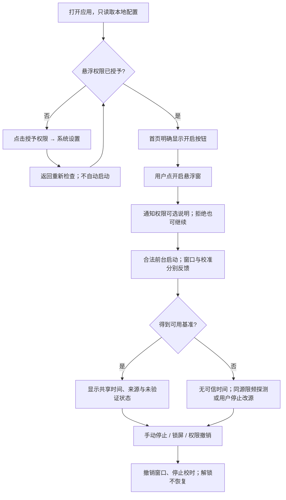

# Floating Clock v0.6.0 产品与 UI/UX 重构设计

状态：**用户已确认 A「静谧卡片」、预设迁移及极简来源／状态标签；渐进实施中**。日期：2026-09-29。

原设计轮次仅交付本文。后续首轮实现严格限于 v0.6.0-home.1 首页视觉样板；其余章节继续作为待实现设计，不代表已交付。
本文所有线框中的时间、按钮倒数和状态组合均为设计示例，不是设备实测结果。

## 1. 结论与范围

产品定位建议调整为：**一个来源透明、支持手动偏移的公共网络悬浮时钟**。
首页回答三个问题：“现在显示什么时间？”“这个时间来自哪里？”“怎样开启或停止悬浮？”

- 默认只有一个公共网络时钟，不要求先选择购物平台。
- 淘宝／天猫、京东、美团、拼多多、抖音保留为五个可选的**手动偏移预设**，不代表官方来源。
- 所有显示行继续共享一个会话时间源。预设只影响显示偏移，不增加网络请求、不改变来源类别。
- 最多三行、统一样式、点击菜单、长按拖动、锁屏停止、解锁不恢复全部保留。
- 主界面拆成首页、外观、高级设置、校时诊断四个清楚的目的地；常用操作留在拇指容易触及的位置。
- 推荐视觉方向 A「静谧卡片」；方向 B「计时仪表」供选择。确认一个方向后再实施，不同时维护两套页面。

### 与 PRD 的关系

PRD §0、§4、§5、T01–T03 将平台入口放在主要流程，本文根据本次用户明确要求提出交互层调整；
不是悄悄修改既定产品需求。确认后需在实施阶段同步 PRD 的入口、默认行与验收文案。
五个稳定平台 ID、历史数据及最多三行能力保持兼容。公共来源不冒称官方、未知误差不填造、
同源重试、不自动运行、隐私与 Android 生命周期边界不变。

不增加倒计时、抢购、自动识别购物 App、账号、云同步、每行独立时间源、真实背景模糊或新网络适配器。
本方案也不增加“仅首页后台校时”这种新会话类型；网络校时仍由用户主动开启悬浮会话触发。

## 2. 审计依据与证据边界

已阅读 PRD.md、AGENTS.md、architecture.md、time-sources.md，并检查现有 MainActivity、SettingsPage、
DiagnosticsPage、OverlayClockView、UserPreferences 及会话同步设计。

| 输入 | 可以确认 | 不能据此确认 |
| --- | --- | --- |
| 用户提供的 v0.5.0 设置长截图 | 外观、平台、时区、全部偏移、来源纵向混排；大量逐字段“应用”按钮；预览标为非当前时间 | 截图不能证明点击响应、TalkBack、真实对比度或运行性能 |
| 用户提供的 v0.5.0 首页长截图 | 已获悬浮权限仍突出“申请权限”；停止态无主时钟；平台清单占据大量空间；版本、FPS、长说明比主任务突出 | FPS 0.0 发生在停止态，不能推断设备低帧率 |
| 用户诊断 floating-clock-diagnostics.json | appVersion 0.5.0、API 36、Asia/Shanghai、accuracyVerified=false；80 条历史记录 | 未提供机型字段，不能据此宣称某一机型或 HyperOS 版本通过验收 |
| 源码及现有架构 | 非演示首页没有连接真实会话的主时钟；诊断显示英文原始字段；悬浮紧凑／极简隐藏部分来源信息 | 用户未提供悬浮窗与诊断页截图，这两页的审计是代码审计，非真机视觉验收 |

### 2.1 诊断 JSON 的实际发现

- 80 条记录全部是 `SYSTEM_NETWORK` / `Android system network time`，状态均为 `SYNCED`，失败原因为空。
- 每个平台 16 条；除 `id` 与 `platformId` 外所有字段相同的记录可以组成 **16 组，每组 5 条**。
  这与当前实现“同一次样本复制为五个平台诊断行”一致；不能称为 80 次独立请求或五个平台各自校时。
- 10 组标记手动同步，6 组未标记手动；没有来源恢复记录。这不等于统计到了全部点击或系统自身联网次数。
- RTT、估计偏移、不确定度、实测误差均为 null。系统网络时钟读取成功不表示本应用刚发起了一次网络校时。
- 13 组有校准跳变量，范围约 −0.550 至 +0.898 ms；这是新旧锚点推演值的调整量，**不是实测误差或精度范围**。
- 3 组没有跳变量；缺少 sessionId，不能仅凭空值推断准确的会话数或停止原因。
- 截图里的“恢复上次手动源：Google”是保存的选择，不是运行中的来源证据；日志实际来源仍为系统网络时间。

设计含义：诊断首屏显示真实来源和可解释状态；空指标显示原因，不显示 `0ms`、空曲线或“±0.9ms”。
原始日志只在本地读取，本文件仅保留必要汇总，不复制原始 JSON、用户目录、截图状态栏信息或完整历史时间线。
这些材料支持 UX 判断，不构成网络准确度、真机 120FPS 或长期稳定性报告。

### 2.2 问题与处理优先级

| 优先级 | 页面与问题 | 影响 | 设计处理 |
| --- | --- | --- | --- |
| P0 | 首页无真实会话主时钟，源策略与实际来源混在一起 | 不知道当前读数和依据 | 主时钟占首屏；来源紧邻数字，策略放详情 |
| P0 | 停止、校时、授权和启动并列为多个按钮 | 不知道下一步 | 独立状态维度；底部只保留一个主要启动／停止动作 |
| P0 | 五个平台共用来源，却像五个官方时钟 | 产生能力误解 | 改名偏移预设，默认关闭平台比较；显示净手动偏移 |
| P0 | 异常被大量说明稀释；极简隐藏来源 | 跳动数字可能被理解为仍准确 | 所有密度保留来源短名和状态；异常优先于装饰 |
| P1 | 设置页长表单，六组偏移与外观混排 | 寻找慢、误触多 | 外观独立；偏移、来源、时区分别进入二级页 |
| P1 | 已授权仍突出申请；已选字体以禁用态呈现 | 状态难懂 | 授权后折叠；选择态用勾选／分段选中，不用灰掉代表选中 |
| P1 | 颜色只能填十六进制；滑块没有便捷精调 | 单手输入成本高 | 色板优先、精确输入次级；滑块配数值和加减按钮 |
| P1 | “背景透明度 65%”实际对应 alpha=0.65 | 数值语义相反 | 改称“背景不透明度”，保留原存储值，不做反转迁移 |
| P1 | 预览很靠下，不能清楚比较密度与错误态 | 修改后不确定效果 | 外观页顶部预览；提供正常／重试／失效预览状态 |
| P1 | 诊断五份重复数据、UTC 原文及英文字段 | 误读采样数、理解成本高 | 测量分组视图＋原始记录；本地时间及中文字段，保留原值 |
| P2 | 每页重复应用大标题与版本、首页常驻 FPS | 技术信息抢占空间 | 小顶栏；版本去关于，FPS 去诊断的渲染详情 |
| P2 | 页面共用外层滚动状态 | 进入新页可能落在中段 | 每页独立滚动位置；首次进入子页从顶部，返回恢复上页 |

## 3. 产品概念与数据保留

### 3.1 统一词汇

| 词汇 | 界面语义 |
| --- | --- |
| 公共网络时钟 | 当前会话公共来源的推演时间；有全局偏移时另标“手动偏移 +N ms” |
| 实际来源 | Android 系统网络时间 / NTP · Cloudflare / NTP · Google / HTTP 估算 · 主机名 / 离线演示 |
| 来源策略 | 自动选择，或用户手动指定；与当前实际来源分开 |
| 手动偏移预设 | 原平台入口的用户偏移配置；名称形如“京东 · 手动预设” |
| 校准成功 | 一次样本通过当前引擎校验；不是精度认证 |
| 实测误差 | 当前均未验证；不能用 RTT、跳变量、手动偏移替代 |

短标签使用“系统网络”“NTP·Cloudflare”“NTP·Google”“HTTP估算”“演示”。
详情展示完整名称；不写“官方同步”“高精度已认证”“网络质量 99%”等无依据结论。
HTTP 估算始终增加“秒级来源，毫秒为推演显示”。系统来源写“系统提供的网络时间，缓存新鲜度未知”。

### 3.2 默认与进阶显示

新安装默认“公共时钟”单行，无平台名称；全局偏移默认 0，时区默认 Asia/Shanghai。
首页“偏移：未启用预设”可打开底部面板，选择一个已保存预设，也可进入比较管理。

进阶“比较多个偏移”最多三行：公共时钟可以作为其中一行，五个平台预设可选；**公共行计入三行上限**。
若取消全部预设，回到公共单行。若三个预设已占满，添加公共行也必须选择替换，不能偷偷增加第四行。
多行共用一条来源／校准状态栏，每行展示名称与手动偏移；相同偏移允许保留，但提示“这些读数相同”，不自动删除。

显示语义保持既有公式：公共行＝共享推演 UTC＋全局偏移；预设行＝公共行＋该预设偏移。
例如全局 +35 ms、京东 −20 ms，京东净偏移 +15 ms；详情同时显示三者，不能把 −20 ms 标成总偏移。
首页主时钟跟随已选列表第一行；启用预设时标题随之成为“京东 · 手动预设”，下方仍明确实际公共来源。

### 3.3 无损迁移规则（实施要求，本轮不执行）

| 旧数据 | 新设计处理 |
| --- | --- |
| 五个 PlatformId 及偏移 Map | ID 和数值不改；淘宝／天猫继续一项，未选中的偏移也保留 |
| 已选择平台及排序 | 老用户默认原样保留为已选预设行，第一行仍为主时钟；不静默改成公共行 |
| 全局偏移、时区 | 原值保留；正负号和单位显式展示 |
| 自动／手动策略、manualSource、HTTPS URL | 原样保留；不因改名重新校准，不显示 URL 的敏感部分 |
| 四皮肤、信息密度、字体、字号、颜色、背景 alpha、位置 | 原值保留；不因选择 App 视觉方向覆盖现有悬浮外观 |
| Room 历史记录 | 原样保留至既有七天清理期限；分组只是查询展示，不删除重复行或重写来源 |
| 活动锚点、服务与请求状态 | 仍不持久化、不恢复；升级后只有用户主动启动才能重新建立会话 |

首次升级显示一次非阻断提示：“平台入口现在称为手动偏移预设，原设置已保留；未接入平台官方时间。”
提供“查看我的预设”和“改用公共单行”；后者必须由用户主动点选，说明它不删除保存的偏移。

实现时只在 app 展示配置层增补公共行的显式选择，不复用某个平台 ID 冒充公共行，不把保存的某个平台偏移临时改成 0。
继续使用现有共享校准与偏移计算能力，不复制公式或改 core 算法。若现有输出契约不足以表达公共行，
先评审最小的只读展示契约，不能悄悄改校时语义。Proto 仅追加字段、不复用编号，迁移需原子、可重复且无破坏性重置。
新版本字段缺失时区分新安装与已有配置；原有配置存在即走保留路径，不能凭偏移都为 0 推定新用户。

## 4. 信息架构

手机采用三个一级底部导航项：**时钟 / 外观 / 诊断**；高级设置为首页和来源详情可到达的二级目的地。
高级设置低频，不占第四个底部项。三个一级页均可一按到达；从首页进入高级设置最多两次点击。
导航数量与位置采用 Material NavigationBar 的原生结构，状态保存不依赖共享长滚动页。[1]

```text
Floating Clock
├─ 时钟（首页）
│  ├─ 来源与校准详情（底部面板 → 高级来源设置）
│  ├─ 偏移快捷面板 → 预设编辑 / 最多三行比较及排序
│  ├─ 权限引导（仅缺失时）
│  └─ 高级设置
│     ├─ 时间来源：自动 / 手动 / HTTPS / 离线演示
│     ├─ 时间与偏移：时区 / 全局偏移 / 五个预设
│     ├─ 权限与运行规则
│     └─ 关于与隐私：版本、仓库、许可、备份规则
├─ 外观
│  ├─ 实时外观预览
│  ├─ 四种皮肤 / 三种信息密度
│  ├─ 字体与字号 / 颜色与背景
│  └─ 位置调整 / 恢复当前外观默认
└─ 校时诊断
   ├─ 最近校时 / 渲染详情
   ├─ 历史筛选 / 测量分组 / 原始记录
   ├─ 单条详情
   └─ 导出范围与格式 / 清除确认
```

导航约定：顶栏返回、系统返回含义一致；一级切换保留各页滚动和筛选，不启动请求。
子页返回上一级；来源详情跳高级设置后返回仍回详情。底部面板按返回先关闭面板；有未应用草稿先确认放弃。
横屏或宽窗口可改为 NavigationRail＋双栏预览，目的地不变；不为本轮设计引入新导航框架。

## 5. 页面线框与交互

以下是结构线框，`[ ]` 表示控件，不代表实际系统图标。正常字体以 360×800 dp 为设计基准，
同时要求 320 dp 窄屏、横屏和 200% 系统字体可用；大字体允许滚动，不能硬塞一屏。

### 5.1 首页：主时钟＋状态＋单一主操作

```text
┌────────────────────────────────┐
│ Floating Clock          [设置] │  小顶栏，版本移至关于
│                                │
│ 公共网络时钟                   │  若第一行是预设则显示预设名
│        17:02:35.218             │  首要视觉焦点
│     2026年9月29日 · 北京时间    │  示例，含日期及可查看时区
│ 系统网络 · 已校准 · 精度未验证 │  来源不是选源策略
│ 上次成功校准：刚刚       [详情]│
│                                │
│ 手动偏移 0 ms           [调整]│  非零不得省略符号与单位
│                                │
│ [!] 通知未允许                 │  仅在相关状态显示
│     仍可从本页停止    [管理]  │
│                                │
│ [重新校准]          [偏移预设]│  常用次操作
│ [         停止悬浮窗         ]│  唯一主操作，底部可达
│ 锁屏后停止，解锁不自动恢复     │  短说明，首次或相关时展示
├────────────────────────────────┤
│  时钟          外观       诊断│
└────────────────────────────────┘
```

- 主时钟始终占据相同结构区域。停止／首次无锚点时显示 `--:--:--.---` 和“尚未校准，开启后获取时间”，
  不把旧历史或设备墙钟当成当前网络时间。运行后与悬浮窗读取同一会话，UI 不再实现一份公式。
- “停止原因：锁屏／用户停止”仅在应用确知时显示；进程终止后不能编造停止原因。
- 未运行时“实际来源”显示“尚未选择”，可附“策略：自动”；历史来源明确标“上次”，不可占用当前标签。
- 有多行时首行大时钟，其余最多两行缩为可阅读的对照行；来源状态只共享一份。
- 授权未获时底部主要动作是“授予悬浮权限”，不显示一个看似可用的启动按钮；返回后改为“开启悬浮窗”。
- 校时与悬浮状态分开：“正在校时”不代表窗口创建完成；只有窗口确实创建后显示“悬浮窗运行中”。
- 已校准与正在后台采样可以同时存在，已有有效读数不因刷新而整块变成加载动画。
- 停止按钮即时可用，不等待网络或保存完成；重新校准冷却时显示“可在 N 秒后重试”，由真实请求预算推导。
  若当前契约不暴露剩余预算，先显示“受请求频率限制”，不得在 UI 虚构倒数。
- FPS 不在首页常驻。诊断可显示“当前未绘制”而不是在停止态输出 0.0 FPS 造成故障印象。

### 5.2 外观：先看效果，再调参数

```text
┌────────────────────────────────┐
│ 外观                      [更多]│
│ ┌────────────────────────────┐ │
│ │ 预览 · 模拟状态             │ │
│ │ 系统网络 · 精度未验证       │ │
│ │        08:00:00.000         │ │
│ └────────────────────────────┘ │
│ 预览状态 [正常] [重试] [失效]  │
│ 皮肤                           │
│ [深色示意卡]  [浅色示意卡]     │
│ [半透明卡片]  [纯数字示意卡]   │
│ 信息量 [完整] [紧凑] [极简]    │
│ 字号       [−]  27 sp  [+]     │
│ ━━━━━━━●━━━━━━━━━━             │
│ [字体：等宽                 >]│
│ [颜色与背景                 >]│
│ [位置调整                   >]│
├────────────────────────────────┤
│ [取消]              [应用外观]│  仅存在草稿时出现
│ 时钟            外观      诊断│
└────────────────────────────────┘
```

预览固定在页面上部，常规字体滚动时可缩为小预览；大字体／横屏空间不足时随内容滚动，不能占满可用高度。
样式修改立即作用于**预览草稿**，不联网；“应用外观”原子保存一组配置，成功后更新现有悬浮 View，不重建服务。
这个批量应用替代每字段一排按钮，也避免拖动滑块频繁写盘。取消恢复已保存值，写入失败保留草稿及旧生效样式。
预览模拟状态的选择永不写成真实校准状态、不产生诊断记录；真实会话运行时可切换“当前会话预览”，仍清楚标注预览区域。

字号滑块加 1 sp 精调按钮，支持直接输入既有 16–64 sp 范围；字体选中有勾选，非禁用。
颜色先给可访问色板，“自定义”再显示 #RRGGBB 输入及相邻字段错误；不更改现有颜色字段语义。
背景不透明度 0% 表示透明、100% 表示不透明。纯数字模式保留颜色设置值，但禁用背景调节并说明原因。
对自定义低对比度提出具体提醒；来源／异常底板使用固定语义颜色，不随用户透明度消失。
四种原悬浮皮肤仍全部可用。半透明风格文案不再暗示读取或模糊其他应用；App 视觉方向与悬浮皮肤分开。
重置只针对当前外观，需确认；不顺带清除偏移、来源、位置以外数据或历史日志。

### 5.3 高级设置：分组摘要，而非全量表单

```text
┌────────────────────────────────┐
│ [返回] 高级设置                │
│ 时间来源                       │
│ [自动选择                   >]│
│ 当前实际来源：系统网络          │  停止时改“尚未选择”
│                                │
│ 时间与偏移                     │
│ [时区              北京时间 >]│
│ [全局手动偏移        +35 ms >]│
│ [五个偏移预设      已启用1个 >]│
│                                │
│ [权限与运行规则             >]│
│ [关于与隐私                 >]│
└────────────────────────────────┘
```

来源页将三件事分成不同小节：**策略（自动／手动）、当前实际来源、保存的手动选项**。
自动说明按 API 呈现：API 33+ 初选系统网络→Cloudflare→Google；API 31/32 初选 NTP 主备。
Google 明示闰秒平滑；HTTP 输入合法公开 HTTPS，明确秒级估算限制；演示独立列在测试用途说明下。
手动选源不偷偷兜底；同源失败不自动切换。运行中允许查看及编辑草稿，但保存来源变更必须先明确“停止会话并保存”；
取消不改变任何状态，确认停止并保存后仍需用户再点启动，不自动重启。只有停机成功才提交该来源配置。

时区页给“北京时间 Asia/Shanghai”快捷项与合法时区搜索；不要求普通用户记忆 ZoneId。
偏移页一次编辑一个值，数字键盘配显式正负切换，标注“正数让显示提前、负数让显示延后”；
显示全局、当前预设及叠加净值，范围沿用 ±86,400,000 ms。输入非法保留草稿、就地提示，不能悄悄改成 0。
更改偏移立即改变保存后的显示，不校准、不改原始锚点；归零当前项与重置全部分开，重置全部有确认。

预设列表展示五项摘要；“加入显示”与“编辑偏移”分开。已选区提供上移／下移的 48 dp 操作，拖动是补充而非唯一排序方式。
达到三行时提示“最多显示三行，选择一行替换”，支持取消；移出显示仅禁用该行，不删除其偏移数据。

### 5.4 校时诊断：解释结果，再展示技术细节

```text
┌────────────────────────────────┐
│ 校时诊断                  [更多]│
│ 最近结果：校准成功              │
│ 实际来源：Android 系统网络时间  │
│ 精度未验证             [详情]  │
│ RTT：系统未提供                │
│ [渲染详情：当前未绘制        >]│
│                                │
│ [来源：全部] [预设：全部]      │
│ [测量分组] [原始记录]          │
│ 16 个匹配组 / 80 条原始记录    │  仅此份日志的示例
│ ── 今天 ───────────────────── │
│ 17:02:xx  校准成功 · 手动       │
│ 系统网络 · 关联5个旧平台行   > │
│ …                              │
│ [上一页]           [下一页]    │
│ [        导出当前筛选         ]│
├────────────────────────────────┤
│ 时钟            外观      诊断│
└────────────────────────────────┘
```

历史时间按用户时区显示日期、时分秒，跨日加日期；详情提供原始 UTC 毫秒与时区，不能只给难读的 ISO 字符串。
“最近历史结果”与“当前会话状态”分区；停机后过去的 SYNCED 不能把首页染成正在运行。

**旧日志分组规则**：仅当除 id、platformId 外所有保存字段完全相同且平台 ID 不重复时折叠；
冲突／不完整组如实展示为部分关联，不能按“时间接近”猜测合并。分组不能跨当前筛选范围混入其他平台，跨分页不能双计。
名称使用“匹配测量组”，不称“网络请求数”。缺少可靠 sampleId/sessionId 时不做会话次数统计或成功率百分比。
未来若增加可靠关联 ID，另行评审非破坏迁移；本设计不要求改校时算法或先改存储结构。

详情先显示中文摘要，再可展开原始字段：实际来源、结果、失败类别、记录时间、上次成功、RTT、估计偏移、
不确定度、跳变量、实测误差、手动／恢复标记、关联原始行 ID。纳秒值可换算成带单位的毫秒展示，保留展开原值。
明确区分“手动偏移”“估计偏移”“校准跳变量”，不能统称“误差”。系统源的 null RTT 写“系统接口未提供”；
实测误差写“未验证”；失败样本无本次指标写“本次未获得”，不拿旧成功值填补。

空列表分别提示“尚无记录”“筛选无结果”“读取失败”；读取失败有重试，不伪装成暂无日志。
清除移入更多菜单，确认“清除本机全部诊断记录，不影响配置”；完成后刷新统计，失败保留原列表并提示。

导出流程：点导出→确认筛选范围（最近七天、当前过滤、所有分页）与 JSON/CSV→系统创建文档→写入→结果。
默认导出仍为全部原始行，不把视觉折叠变成数据丢失；明确“导出原始记录，包含共享测量的关联行”。
取消选择显示“已取消”，不请求额外存储权限；失败说明空间或访问问题及可能存在不完整文件，可重试。
导出中防止重复点击，显示不确定进度；没有总量依据不画虚假的百分比。执行清除前等待本次导出结束或取消清除。
只输出现有脱敏字段，不附加完整配置 URL、Cookie、凭据或用户路径；遵守现有 no-backup 策略。

## 6. 统一状态与完整操作流程

### 6.1 三个独立维度

1. **权限**：未授予／已授予／撤销；通知权限另列，可拒绝。
2. **会话**：停止／启动中／运行／停止中／启动失败；是否存在窗口用真实生命周期确认。
3. **校准**：未校准／校准中／成功／失败保留基准／失效；同时读取 anchorUsable，不能只看一个枚举决定是否显示数字。

状态从既有引擎和 Service 映射，UI 不发明新的失败次数阈值、有效期或调度器。

| 情况 | 主时钟与短反馈 | 可用动作 |
| --- | --- | --- |
| 配置读取中／失败 | 占位；“正在读取配置”／“配置读取失败，尚未启动” | 失败提供重试；不绕过读取启动 |
| 缺少悬浮权限 | 占位；解释一次授权用途 | 授予悬浮权限；外观及诊断仍可用 |
| 已授权、停止 | 占位；“尚未校准”或明确停止原因 | 开启悬浮窗 |
| 初始校准中 | 占位＋进度；“正在读取系统网络时间”等真实候选名称 | 取消／停止；禁止重复启动 |
| 成功 | 持续读数；“已校准 · 精度未验证” | 同源重新校准、停止、外观、偏移 |
| 重试，有可用旧锚点 | 继续推演；“重试中 · 使用上次基准”＋最后成功信息 | 同源重试（限频）、停止、查看原因 |
| 连续失败、仍允许旧锚点推演 | 数字旁强警告“校准失效 · 旧基准”，不可关闭 | 查看诊断、停止后改源；仍探测原源 |
| 无锚点／时钟回退／溢出等不可用 | `--:--:--.---`；“无可信时间” | 停止／重试；不残留上一帧数字 |
| 通知拒绝但会话运行 | 正常读数；“通知未允许，可从首页停止” | 停止按钮始终可达 |
| 窗口创建／前台服务失败 | 占位；“未能开启悬浮窗”＋确知的原因 | 回首页重试或权限设置，不显示成功 Toast |
| 锁屏后解锁 | 占位；“已停止，请手动开启” | 手动重启，创建新锚点 |
| 演示模式 | 持续演示时间；所有页与窗口持续标“演示数据” | 退出演示；不生成真实成功／精度暗示 |

本次日志没有失败、恢复或 NTP/HTTP 实机样本；这些异常界面是根据现有契约设计的验收场景，不声称已真机观察。

### 6.2 首次授权及日常使用



通知授权只在相关操作时按系统能力申请，已拒绝后不每次弹出；返回首页若不处于可启动状态，需再次由用户点击。
系统授权页无法打开时提供简短手动路径，不循环跳转、不引导使用无障碍绕过权限。
已获授权的用户日常从首页只需一次“开启”；不重复走新手说明。

### 6.3 校准、切源、修改与退出

- **立即校准**：只在活跃会话向既有同步器发请求；系统源按钮说明“重新读取系统网络时间”，
  不称“强制系统联网”。请求进行中合并重复点击；限频反馈不误写为断网。
- **失败**：状态栏常驻原因摘要与“查看诊断”；短暂 Snackbar 不能替代持续警告。原源恢复后显示“同源已恢复”，
  取消旧错误提示，但仍保留“精度未验证”。不对失败做自动跨源恢复。
- **来源修改**：编辑草稿→说明停止影响→确认停止并保存→回首页手动开启；退出草稿则不改变来源。
- **偏移修改**：编辑→校验→显示叠加净值→原子保存→当前显示更新；停止或运行均可编辑，无网络请求。
- **外观修改**：编辑草稿即预览→应用→保存成功→更新现有窗口；保存失败维持旧生效值。
- **退出应用页面**：正在运行的会话不因导航或普通回到购物 App 而停止；锁屏／手动停止按原规则清理。
- **系统杀进程／重启**：恢复配置和历史，不恢复运行；缺少确切原因时只说“当前未运行”。

## 7. 悬浮窗设计

三种信息密度改变次要详情，不改变来源真实性。相较旧 PRD“极简只显示数字”，
建议增加不可隐藏的**短来源＋未验证／异常标签**；这是本轮待确认的安全表达调整，不删除原密度枚举。

```text
完整（单行示例）
┌───────────────────────────────┐
│ 公共网络时钟                  │
│ 17:02:35.218                  │
│ 系统网络 · 已校准             │
│ 精度未验证 · 手动偏移 +35 ms  │
└───────────────────────────────┘

紧凑
┌───────────────────────────────┐
│ 京东预设 +15 ms（净偏移）     │
│ 17:02:35.198                  │
│ 系统网络 · 未验证             │
└───────────────────────────────┘

极简（无预设、无偏移）
  17:02:35.183
  系统网络 · 未验证

极简异常（覆盖任何皮肤）
  17:02:35.183
  系统网络 · 校准失效 / 旧基准
  精度未验证

多行比较（最多三行，来源共享）
┌───────────────────────────────┐
│ NTP·Cloudflare · 精度未验证   │
│ 公共 +35 ms      17:02:35.218 │
│ 京东预设 +15 ms  17:02:35.198 │
│ 淘天预设 +35 ms  17:02:35.218 │
└───────────────────────────────┘
```

极简下如启用预设或非零偏移，必须增一行名称／净偏移，不能把人工修正后的数字冒充原始公共时间。
“淘天”仅作窄窗口短名，菜单完整显示淘宝／天猫；所有预设都标“预设”，不使用品牌 Logo 暗示合作。
极简正常来源字样也至少按 12 sp 基准并随系统字体放大；异常使用 14 sp 起，不跟随整块时钟缩放变成小字。
公共行无偏移时可省略 0 ms；异常和 HTTP 秒级限制不可省略。未知误差永不配装饰性徽章、评级条或 ± 数字。

### 菜单、拖动与位置

点击容器打开同一个 Window 内的菜单，不在屏幕外铺透明点击层；关闭菜单有明确按钮。
菜单顺序：当前来源／状态→同源重新校准→偏移预设→外观与位置→**停止悬浮窗**→收起。
停止不需要二次确认；清除数据等破坏性操作不放在悬浮菜单。完整来源长名在菜单换行，不横向滚动。
菜单打开时暂停非必要帧绘制，收起后从同一单调锚点读时间，不把菜单停留时长累计进计时。

长按达到系统阈值后给予一次轻触反馈再整体拖动，取消本次单击；拖动结束保存安全区域相对位置。
提供菜单“位置调整”的上／下／左／右步进、回到可见区域及关闭，兼顾不能长按拖动的人。
数字区域触摸矩形即窗口范围；扩大无障碍触点不得延伸为覆盖半屏的透明窗。容器外不拦截底层操作。
横竖屏／IME／刘海变化重新夹限位置；大字体先重排、扩高，空间不足提示调整字号或减少显示行，
不能悄悄删行、缩小警告、裁掉停止入口。菜单可垂直滚动，时钟不横向滚动。
宿主 App 隐藏悬浮时只能解释系统限制，不能根据“服务仍运行”断言窗口在任何 App 上都可见。

## 8. 两种视觉方向

两方向在信息规则、四皮肤、三密度和导航上完全一致；差异是布局、字重、容器和节奏，不是仅换主题色。
以下均为待选设计，而非已经运行的 UI。

| 维度 | A：静谧卡片（推荐） | B：计时仪表 |
| --- | --- | --- |
| 印象 | 日常工具，轻、清楚、容易上手 | 专注读数，克制的仪表感 |
| 首页构图 | 居中主时钟，独立大卡片；状态与操作分组 | 左对齐大数字，横线分区；来源为紧凑的键值行 |
| 容器 | 时钟卡 24 dp 圆角，普通卡 16 dp，少量 1 dp 层级 | 主读数区不套卡，设置区 8 dp 圆角，0 dp 阴影 |
| 主色 | 冷静蓝；不以紫色按钮堆满页面 | 暖琥珀；不使用荧光、扫描线、拟真七段字 |
| 字体节奏 | 标题与正文系统无衬线，数字等宽、居中 | 数字等宽、中等字重，字段列对齐，标题更小 |
| 密度 | 24 dp 分组间隔、16 dp 卡内边距 | 16 dp 分组间隔、12 dp 内边距；触点仍 ≥48 dp |
| 适合 | 单时钟、常用开启和外观调整 | 常看来源／偏移与诊断的用户 |
| 代价 | 同屏技术细节略少 | 容易显得技术化，需要严格控制术语数量 |

```text
A 首页构图                        B 首页构图
┌──────────────────────┐          ┌──────────────────────┐
│Floating Clock   设置 │          │FLOATING CLOCK   设置 │
│ ╭──────────────────╮ │          │公共网络时钟          │
│ │  公共网络时钟    │ │          │17:02:35.218          │
│ │ 17:02:35.218     │ │          │──────────────────────│
│ │ 系统网络·未验证 │ │          │来源  系统网络        │
│ ╰──────────────────╯ │          │校准  已成功 / 未验证 │
│ [偏移 0 ms     调整] │          │偏移  +0 ms           │
│                      │          │──────────────────────│
│ 重新校准    偏移预设 │          │重新校准     偏移预设 │
│ [     开启悬浮窗   ] │          │[     开启悬浮窗     ]│
│ 时钟    外观    诊断 │          │ 时钟    外观    诊断 │
└──────────────────────┘          └──────────────────────┘
```

上图以读数表示视觉比例，实际未启动态必须替换占位；按钮与运行状态严格遵循 §6，不能照抄组合成不真实的页面。
推荐 A：主任务更突出、中文长标签更容易换行，契合本次从“配置控制台”转向“时钟工具”的目标。
B 作为替代，不意味着需要额外诊断指标；任何没有依据的数据都不因仪表风格而补造。

## 9. 统一设计系统

### 9.1 颜色 token（设计建议值）

采用 MaterialTheme 的语义角色映射，页面不各自定义颜色；方向确定后只保留选中列。
深浅模式默认跟随系统，外观中的 App 主题可选跟随／浅色／深色；不会改变用户悬浮皮肤。
本阶段不增加动态壁纸配色，避免与安全状态色、自定义悬浮配色混淆。Material 3 官方的主题分层为颜色、字体、形状。[2]

| 角色 | A 浅 | A 深 | B 浅 | B 深 |
| --- | --- | --- | --- | --- |
| surface 页面 | #F5F7FA | #10151D | #F5F2EA | #12120F |
| surfaceContainer 卡片 | #FFFFFF | #18212D | #FFFFFF | #1E1F19 |
| onSurface 主文字 | #17212B | #E8EDF4 | #29261E | #F0EDE3 |
| onSurfaceVariant 辅助文字 | #475569 | #B8C4D4 | #615848 | #C4C1B3 |
| primary 主动作／选中 | #0B57D0 | #A8C7FA | #805500 | #E6C566 |
| onPrimary 按钮文字 | #FFFFFF | #062E6F | #FFFFFF | #342800 |
| outline 可操作边界 | #64748B | #8493A7 | #7B7060 | #9B9685 |

跨方向共享状态色：浅色成功文字／底色 `#176B3A / #E6F4EA`，警告 `#6B4E00 / #FFF2C6`，错误 `#B3261E / #F9DEDC`；
深色分别 `#83D7A5 / #102E20`、`#F5D782 / #382D0B`、`#FFB4AB / #601410`。
成功色只表达“采样成功”，不表达精度；“精度未验证”常态用中性色文字，不把整个页面长期画成红色。

已用 sRGB 相对亮度公式静态计算：

| 配对 | A 浅 | A 深 | B 浅 | B 深 |
| --- | --- | --- | --- | --- |
| 主文字 / 页面 | 15.18:1 | 15.56:1 | 13.50:1 | 16.02:1 |
| 辅助文字 / 卡片 | 7.58:1 | 9.18:1 | 7.01:1 | 9.19:1 |
| 按钮文字 / 主色 | 6.39:1 | 7.50:1 | 6.53:1 | 8.65:1 |

状态文字／底色最低为浅错误 5.14:1。以上仅验证不透明色对，不代表全 UI 或叠加在购物 App 上的半透明窗口已通过无障碍测试。
普通文字目标 ≥4.5:1，必要控件边界 ≥3:1；异常底板保持不透明。透明背景下仅加文字阴影不足以保证对比度，
应对来源与异常保留小底板，并在自定义数字不可读时提示选择描边／底衬或提高不透明度，不能宣称任意背景都通过。[3]

### 9.2 字体、尺寸与空间

中文使用系统无衬线及系统中文回退；数字使用系统等宽或 tabular figures，保留既有三种悬浮字体选择。
不下载远程字体、不引入西文字体作为中文唯一字体、不为“仪表感”使用难辨认的七段数字。

| 用途 | 基准字号 / 行高 | 使用规则 |
| --- | --- | --- |
| 主时钟时分秒 | 48 / 56 sp | 等宽；毫秒 24 / 32 sp 同基线，不闪烁冒号 |
| 页面标题 | 22 / 28 sp | 映射 titleLarge，不重复放开发版本 |
| 分组标题 | 16 / 24 sp | medium，中文不强行加字距 |
| 正文／设置行 | 16 / 24 sp | 文字可换行，行高随系统字体 |
| 来源／说明 | 14 / 20 sp | 不截断错误原因，长主机名允许换行 |
| 操作标签 | 14 / 20 sp | medium，48 dp 最小触点；文本大时按钮增高 |
| 悬浮数字 | 既有 16–64 sp | 全行统一，默认保留用户值 |

这些值映射为命名 Typography token；使用 Android sp 的系统换算，不能手工乘 fontScale 假定所有字号线性缩放。
Material 字体角色作为基础，主时钟为本产品自定义角色；200% 字体优先重排，不覆盖系统 fontScale。[2][4]

间距尺度：4、8、12、16、24、32 dp；手机水平页边距 16 dp；主 CTA 基准高度 56 dp、最小 48 dp；
图标视觉大小 24 dp、触点 ≥48×48 dp，相邻操作留 8 dp。设置行最小 56 dp，多行自动增高。
方向 A 圆角 8/16/24 dp，方向 B 4/8/16 dp；对话框和底部面板遵守 Material 组件形状，不任意嵌套十几层卡片。
普通控件复用 Compose Material 3 的 Button、ListItem、SegmentedButton、Slider、TextField、NavigationBar；
菜单／简短编辑使用底部面板，长来源表单使用完整页面；不把整套设置装进不可伸展的小弹窗。[5]

### 9.3 组件状态

| 状态 | 规则 |
| --- | --- |
| 默认 | 一屏一个主要填充 CTA；次操作 tonal／outlined／text，各自层级一致 |
| 选中 | 勾选＋容器色／描边＋可访问 selected 状态；不依赖紫色或置灰区分 |
| 按压／焦点 | Material ripple、清晰焦点边界；不缩放整个页面或改变布局尺寸 |
| 禁用 | 禁用语义＋旁边可读原因；必须信息不使用低对比度禁用文字 |
| 加载 | 保留操作宽度与短标签；停止可用；不显示无依据百分比 |
| 字段错误 | 输入下方具体原因＋保留输入；提交时聚焦首个错误，不能只在按钮换文案 |
| 保存成功 | Snackbar“已应用”；不反复打断，窗口已更新可见 |
| 保存失败 | 持续就地错误＋重试；不能显示成功后静默回滚 |
| 校准失效 | 图标＋短文＋高对比底板，持续可见；不是一闪即逝的 Toast |

图标统一采用 Android Material 风格矢量资产，配文字；不照搬 Skill 的 React 图标包，不使用购物品牌 Logo 或 emoji 充当结构图标。
过渡建议 150–250 ms，仅状态和导航；尊重系统减少动画设置，不让动画结束成为状态正确性的前提。
数字直接更新，不做翻牌／跳动缩放／呼吸光效；渲染节奏与网络采样依然隔离。

## 10. 单手、中文、大字体与无障碍

- **单手**：启动／停止、重新校准、底部导航在下部；低频设置可在顶栏，首页来源详情也能从下部操作进入。
  键盘出现时操作区避让 IME，底部导航可让位于编辑确认；不让固定预览遮住输入框。
- **安全区**：Scaffold 内容、固定底部操作与系统导航／手势区分别处理 insets，避免重复留白或遮挡。
  自绘悬浮窗口也遵守可用边界；不从截图像素反推固定 dp。[6]
- **大字体**：设置列表自适应增高；并排按钮改竖排；四皮肤卡片由两列改单列；分段控件放不下时改完整文字的选择列表。
  不把“系统网络时间”“精度未验证”省略为无法解释的图标。
- **主时钟窄屏策略**：普通宽度显示 `HH:mm:ss.SSS`；200% 字体放不下时分两行：第一行 `HH:mm`，第二行 `ss.SSS 秒`，
  保留同一次读数、完整日期与来源；无障碍语义仍是一条完整时间。不能把毫秒截掉后还称毫秒时钟，也不缩回小字抵消字体放大。
- **中文**：正负号、数字和 ms 不拆散，时区给中文名＋ZoneId；按钮用动作词“开启悬浮窗”“应用外观”，避免“确定”到处复用。
  英文主机名独立一行可换行；重要来源、偏移与状态不 ellipsis；原始长字段在详情展示。
- **TalkBack**：时钟合并为一个可读节点，用户聚焦时读当前完整时间；不把每帧毫秒做 live region 广播。
  校准失败／恢复仅在状态变化时礼貌播报一次，不抢走编辑焦点；装饰图标不重复朗读。[7]
- **非手势路径**：拖动有位置按钮，排序有上下移；所有图标按钮有名称；返回和关闭面板始终可见。
  透明窗也不能扩大成覆盖其他应用的隐形点击面。

## 11. 验收清单（后续实现阶段执行）

本轮是设计交付；以下均为待执行验收，不以“有设计条目”冒充测试通过。现有 129 项测试继续保留，UI 文案断言如需更新应说明映射，不能删除失败场景。

| ID | 输入／操作 | 可观察通过标准 |
| --- | --- | --- |
| UX01 | 新安装，只打开首页 | 有主时钟区域和唯一下一步；不自动联网或开服务；无平台选择门槛 |
| UX02 | 未授权→拒绝→授权返回 | 拒绝不创建窗口；返回只更新权限，不自动启动；已授权不再突出申请按钮 |
| UX03 | 用户主动开启，注入未完成样本 | 显示正在校时占位，窗口和校准反馈独立；重复点击不建多个会话 |
| UX04 | 成功锚点→首页和悬浮 | 同一快照、来源和偏移语义一致；不出现第二套 UI 时间算法 |
| UX05 | 停止／锁屏后解锁／进程重启 | 历史 SYNCED 不成为当前时间；无网络／窗口自动恢复 |
| UX06 | 失败有旧锚点、连续失败、无锚点 | 对应继续推演或占位；所有密度警告可见；无自动跨源 |
| UX07 | API 31 与 API 33+ 来源策略 | UI 准确表达适用顺序；系统读取不称强制联网；保存手动源不冒充实际来源 |
| UX08 | 所有来源类型＋演示 | HTTP 估算、秒级限制、系统／NTP 名称、演示标记均准确；没有 OFFICIAL 暗示 |
| UX09 | v0.5 配置含五个不同正负偏移、三行排序、自定义皮肤／URL／位置 | 升级逐字段等值保留，未启用预设数据仍存在；不恢复活动锚点 |
| UX10 | 取消全部预设、加入第四行、替换和重排 | 公共单行回退；总计最多三行；取消替换无改动；重启顺序不丢失 |
| UX11 | 全局 +35、京东 −20 ms | 公共净 +35、京东净 +15；显示明确手动；改偏移不发网络 |
| UX12 | 外观四皮肤×三密度，运行中调整 | 预览即时；取消不改存储；应用只更新原窗口；来源／异常不隐藏 |
| UX13 | 配置写入失败、非法时区／偏移／颜色 | 草稿保留、就地具体错误、旧值继续生效；无假成功 |
| UX14 | 点击、长按、拖动、菜单排序、位置按钮 | 点击与拖动不误触；窗外点击正常；停止入口始终可达 |
| UX15 | 用合成的五行重复样本、跨页／部分筛选／冲突记录 | 分组计数准确、原始行不丢、不能按近似时间合并；不伪称网络请求数 |
| UX16 | 系统源 null 指标、失败样本 | 显示未提供／未知／未验证；不显示 0ms、±值或伪成功率 |
| UX17 | 筛选→详情→返回→导出 JSON/CSV | 保持筛选与位置；所有分页原始记录导出，单位及脱敏一致；取消无错误 |
| UX18 | 满盘／权限／关闭流失败、清除失败 | 明确失败与不完整文件提示；不丢原日志；允许重试 |
| UX19 | 320/360/412 dp，横竖屏，字体 100/130/150/200% | 来源、异常、正负单位、停止可读可操作；无横向溢出；数字按规则重排 |
| UX20 | 深浅主题＋自定义透明窗背景 | 静态文字对比度达标；复杂底图检查来源／异常底板；不可读组合有提醒 |
| UX21 | TalkBack、键盘／开关访问、减少动画 | 不逐帧播报；选中／禁用原因清楚；手势有替代；焦点不被固定条遮挡 |
| UX22 | 切页／返回／旋转／进入系统文档选择器 | 各页独立状态；草稿按规则保留；不误启动同步或丢失导出反馈 |

实施验证仍需 `testDebugUnitTest`（含 core）、`lintDebug`、`assembleDebug`、API 31/33/35 仪器测试；
新增大字体、状态映射、无损迁移和语义测试。用户 API 36 真机后续重点验证可读性、权限流程与跨 App 操作，
不因现有两张截图就勾选这些项目。120FPS／50ms 的独立验收不属于本轮设计结论。

## 12. 设计交付检查与待确认项

本轮已完成：材料与源码审计、诊断 JSON 汇总、四页面线框、悬浮三密度、两方向深浅色、
迁移规则、异常状态和验收清单；计算了指定不透明色对的对比度。
静态检查通过：文档代码围栏闭合、本地引用存在、无行尾空白；重新解析用户 JSON 核对 80 条／16 组及未知指标。
工作区核对确认本轮仅新增本设计文件；用户原有未跟踪 Skills 保持原样，未提交或推送。
本轮 **NOT RUN**：Android 构建、单元测试、模拟器、新 UI 可用性测试、真机对比度／TalkBack／性能测试；
原因是本轮未实现或改动可执行代码。静态设计核对不能代替这些检查。

确认后建议按以下顺序实施：先冻结术语／迁移映射→首页和导航→外观与预设→诊断呈现→状态、大字体及设备回归。
不把“重构设计”作为改算法、删日志或重置旧用户设置的理由。

请确认：

1. 选择 **A 静谧卡片（推荐）** 还是 **B 计时仪表**。
2. 是否接受默认公共单时钟、老用户原样保留预设行、平台改为手动偏移预设的迁移方案。
3. 是否接受极简模式仍保留短来源／未验证标签，以及出现偏移或异常时增加必要说明。

本轮到设计交付为止，等待确认后再进入代码实现；不提前升级为 v0.6.0 构建、不修改 PRD。

## 13. 方法与官方参考

使用仓库 `ui-ux-pro-max` Skill：运行 `clock utility minimal mobile --design-system`，
并用更窄的 `utility clock tool` 重试；返回的主题中采用单一主操作、数字焦点和克制装饰，
不采用落地页结构、远程 Inter 字体、CSS／React 图标或“只做深色”。统一设计规范集中在本文件，未生成第二份互相冲突的设计系统。
另查询 `accessibility adaptive typography --stack jetpack-compose`，采用 Theme/Typography/Semantics 建议；
`dynamic text scaling` 与 `dynamic-type --domain ux` 未得到直接匹配系统大字体的可靠条目，改依 Android 官方依据设计。
Skill 数据中的版本字段不是本项目升级依据，本轮不升级依赖。

以下官方文档于 2026-09-29 查阅；它们支持组件和可访问性原则，本文布局、配色及产品判断属于本项目设计建议。
Material 站点的色彩／字体页依赖脚本，正文未能读取，具体原则以可读取的 Android Developers 文档交叉核对。

1. [Compose Navigation bar](https://developer.android.com/develop/ui/compose/components/navigation-bar)：一级导航结构。
2. [Material Design 3 in Compose](https://developer.android.com/develop/ui/compose/designsystems/material3)：颜色、字体、形状与主题。
3. [Compose Accessibility API defaults](https://developer.android.com/develop/ui/compose/accessibility/api-defaults) 和 [Android accessibility](https://developer.android.com/guide/topics/ui/accessibility/apps.html)：触点和对比度。
4. [Support user-scalable content](https://developer.android.com/develop/ui/compose/accessibility/scalable-content)：重排、系统字体缩放及非手势替代；本产品不额外引入捏合手势。
5. [Compose Bottom sheets](https://developer.android.com/develop/ui/compose/components/bottom-sheets)：模态面板及其关闭行为。
6. [Window insets](https://developer.android.com/develop/ui/compose/system/insets)：系统栏、IME 与安全内容区域。
7. [Compose Semantics](https://developer.android.com/develop/ui/compose/accessibility/semantics)：状态、语义分组与辅助服务反馈。
8. 项目依据：[PRD](../PRD.md)、[架构](architecture.md)、[来源审计](time-sources.md)、[现有验证](testing.md)。


### 已确认后的首轮实现范围

用户确认选择 A，并要求先交付首页浅深色、真实引擎读数与停止／正常／失效状态，
通过 API 35 截图和 Debug APK 真机确认后再推进其他页面。预设迁移和悬浮极简标签虽然已获方向确认，
本轮不执行：原服务、校时算法、DataStore、Room 和用户配置保持不变，首页明确标注已有第一行预设及净偏移。
